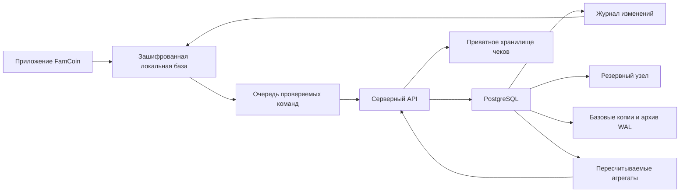

# FamCoin — архитектура хранения данных

Статус: принятая технологическая основа и требования к реализации. Обновлено **22.09.2026**. Документ не означает, что база или облако уже развёрнуты.

## 1. Основа и политика версий

**Основная серверная база FamCoin — PostgreSQL 18.6.** На дату проверки это актуальный стабильный выпуск. Перед первым развёртыванием повторно проверяется официальный список: используется последний стабильный выпуск, прошедший проверки приложения и миграций. [Версии PostgreSQL](https://www.postgresql.org/support/versioning/).

В рабочей конфигурации фиксируются точная версия и образ с проверенным digest. Обновления исправлений устанавливаются после проверки совместимости и восстановления. Переход на новую основную версию проходит отдельный прогон миграций, индексов и финансовых контрольных примеров. Бета- и RC-выпуски используются только в испытательной среде.

Новые возможности PostgreSQL 18, полезные для FamCoin: упорядоченные по времени UUID через `uuidv7()`, асинхронный ввод-вывод, улучшения составных индексов и включённые по умолчанию контрольные суммы новых кластеров. Применение и настройки проверяются на нагрузке; наличие новой возможности не является измерением ускорения нашего приложения. [Release 18](https://www.postgresql.org/docs/18/release-18.html).

Для пользователя результат этой архитектуры — сохранность истории, точные остатки, быстрый поиск и восстановление после сбоя.

## 2. Слои хранения

| Слой | Технология / решение | Что хранится |
|---|---|---|
| Мобильное устройство | SQLite с шифрованием SQLCipher, доступ через слой данных Flutter | Локальная копия, черновики, очередь изменений, локальные агрегаты |
| Основная серверная база | PostgreSQL 18.6 с транзакциями, ограничениями и изоляцией владельцев | Подтверждённый финансовый журнал, справочники, планы, подписки, состояния синхронизации |
| Исходные файлы | Приватное объектное хранилище с шифрованием и политиками доступа | Чеки, разрешённые пользователем вложения, временные результаты обработки |
| Резервные копии | Базовые копии PostgreSQL и непрерывный архив WAL в отдельном защищённом хранилище | Восстановление состояния базы и контрольные точки |
| Производные показатели | Обычные таблицы агрегатов PostgreSQL и локальные проекции | Дневные/месячные итоги, доступные для полного пересчёта |

PostgreSQL — источник подтверждённого состояния между устройствами. Офлайн-операция сначала надёжно сохраняется на устройстве и отображается как ожидающая синхронизации; сервер подтверждает её после проверки. Эта разница видна пользователю.

SQLite остаётся локальным мобильным слоем: она позволяет работать с историей и вводить операции без сети. PostgreSQL работает на сервере и не требует постоянного соединения мобильного интерфейса с базой. [Назначение SQLite](https://www.sqlite.org/whentouse.html).

Локальные файлы шифруются SQLCipher; ключ хранится средствами защищённого хранилища платформы. Выбирается совместимая актуальная стабильная сборка и проверяется восстановление на другом устройстве. Политика бэкапа SQLite учитывает WAL: простое копирование только основного файла во время записи недопустимо. [SQLCipher](https://www.zetetic.net/sqlcipher/design/), [SQLite WAL](https://www.sqlite.org/wal.html).

## 3. Финансовый журнал

Одна пользовательская операция состоит из связанных проводок, категорий, семейных долей и ссылок на долг/цель. Все последствия проведения сохраняются в одной транзакции PostgreSQL. Пользовательское действие не может завершиться с одной стороной перевода.

Рабочие группы таблиц:

- `users`, `ledger_spaces`, `family_members` — владелец и режим учёта.
- `money_accounts`, `ledger_accounts`, `transactions`, `postings`, `transaction_splits` — денежные счета и внутренний журнал.
- `debts`, `debt_events`, `loan_schedules` — обязательства, требования и графики.
- `goals`, `reservations`, `goal_tasks`, `budgets`, `limits`, `allocations` — назначение средств и планы.
- `planned_payments`, `recurrence_rules` — ожидаемые события отдельно от факта.
- `assets`, `valuations`, `bonus_wallets`, `exchange_rates` — прочие активы и оценки.
- `receipts`, `attachments`, `voice_dictionary`, `templates` — быстрый ввод.
- `sync_commands`, `space_revisions`, `change_log`, `outbox`, `audit_events` — повторы, синхронизация и доставка событий.
- `daily_totals`, `monthly_totals` — восстановимые проекции.
- `subscriptions`, `entitlements`, `ai_usage` — право Pro и квоты, отдельно от финансовых счетов пользователя.

Денежные значения хранятся как `BIGINT` в минимальных единицах конкретной валюты. Для курсов и процентов — `NUMERIC` с явной точностью. Проверяются допустимые диапазоны, переполнение промежуточных вычислений и округления. В сетевом JSON целые деньги передаются десятичными строками, чтобы клиенты с ограниченной точностью чисел не потеряли младшие разряды.

Каждый пользовательский объект связан с `space_id`. Составные внешние ключи не позволяют сослаться из одного журнала на счёт другого владельца. Категории, цели, долги и части операции проверяются на принадлежность тому же пространству.

Сумма проводок должна удовлетворять финансовому контракту операции. Контроль выполняется серверным модулем и ограничениями базы, включая проверки целостности полного набора записей на завершении транзакции. Для обмена валют фиксируются две суммы и согласованная оценка; разные валюты не складываются без преобразования.

Исправление сохраняет след: отменяющий эффект и новая версия либо эквивалентная версионная модель с одним активным эффектом. История правок не входит повторно в остаток. Записи о цели не увеличивают активы, планы не меняют баланс, а выплата уже признанной комиссии не создаёт второй расход.

## 4. Одновременные изменения и повтор запросов

Каждая команда имеет `command_id`, `space_id`, ожидаемую версию изменяемого объекта и отпечаток содержимого. Пара `(space_id, command_id)` уникальна. Повтор той же команды возвращает сохранённый результат; повтор того же ID с другим содержимым отклоняется.

Изменяемые связанные остатки/резервы блокируются в определённом порядке. Финансовые ограничения проверяются внутри той же транзакции. Для сценариев, где требуется сериализуемая изоляция, сервер умеет безопасно повторять отклонённую транзакцию по тому же `command_id`. Уровень изоляции выбирается для конкретной операции; одна только метка ACID не заменяет защиту от гонок. [Изоляция транзакций PostgreSQL](https://www.postgresql.org/docs/18/transaction-iso.html).

В той же транзакции создаются запись аудита и событие `outbox`. Фоновый обработчик доставляет события повторяемо, а получатель устраняет дубли по ID. Это применяется к обновлению производных отчётов и фоновым задачам. Внешние вызовы ИИ, OCR и уведомлений не держат открытой финансовую транзакцию.

## 5. Синхронизация мобильных устройств

1. Устройство сохраняет операцию и команду отправки в одной локальной транзакции.
2. При наличии сети отправляет команду вместе с ожидаемой серверной версией.
3. Сервер проверяет сессию, владельца, тарифные ограничения и финансовые связи.
4. Сервер проводит команду, сохраняет результат и подтверждает новую ревизию.
5. Устройство получает изменения после последнего подтверждённого курсора и применяет их атомарно.

Курсор синхронизации отражает порядок подтверждённых изменений. Простая последовательность, полученная до коммита, или время UUID не являются достаточной гарантией: более ранняя команда может завершиться позже. Рабочее решение — ревизии внутри пространства с блокировкой строки ревизии до коммита; конкурентные изменения одного пространства получают согласованный порядок. При переходе на CDC сохраняется эквивалентная гарантия коммитов.

Правка одного объекта с двух устройств проверяет версию. Сервер возвращает конфликт с обеими редакциями. Денежные данные не сливаются молча по времени последней записи. Повтор удаления, возврата и автоматического планового платежа также идемпотентен.

Переход Pro → обычный тариф согласуется с локальной очередью: уже записанные офлайн-черновики сохраняются, пользователь видит, для каких операций нужно выбрать доступный счёт или восстановить Pro. Подтверждённая история не исчезает при изменении прав.

## 6. Изоляция пользователей и защита доступа

На таблицах пользовательских данных применяется Row-Level Security, где это предусмотрено схемой, вместе с проверкой владельца на уровне API. Права роли приложения ограничены; роль миграций отделена от роли пользовательских запросов. Для таблиц владельца учитывается поведение владельца таблицы и `BYPASSRLS`, при необходимости включается `FORCE ROW LEVEL SECURITY`. [Политики RLS](https://www.postgresql.org/docs/18/ddl-rowsecurity.html).

Контекст владельца устанавливает доверенный сервер после проверки сессии, внутри текущей транзакции. Идентификатор из тела запроса сам по себе не предоставляет доступ. При пуле соединений контекст не должен оставаться от предыдущего пользователя. Проверки включают подмену `space_id`, связанные объекты другого владельца, фоновые задачи и обработку вложений.

Соединения защищены TLS; диски, объектное хранилище и резервные копии шифруются средствами инфраструктуры с управлением ключами. Это отдельная настройка инфраструктуры: не предполагается, что PostgreSQL автоматически шифрует всё на диске. Ключи, пароли и клиентские данные не хранятся в Git.

Доступ к файлам выдаётся после проверки владельца через короткоживущие ссылки. В базе хранятся владелец, ключ объекта, размер, тип и контрольная сумма; сам бакет закрыт. Права на квоты ИИ и Pro не позволяют расширить доступ к чужому журналу.

## 7. Поиск, отчёты и работа за годы

Первичные ключи используют UUID, для новых записей подходит UUIDv7. При офлайн-создании ID генерируется совместимым клиентским модулем; время устройства не является основанием для порядка синхронизации или проведения операции.

Основные запросы поддерживаются составными B-tree индексами по пространству, дате и устойчивому вторичному ключу. Частичные индексы допустимы для востребованных активных состояний. Журнал использует курсорную пагинацию, а не загрузку всех строк.

Для поиска по продавцам и заметкам можно использовать `pg_trgm` с проверяемой нормализацией и подходящими индексами. Русский, казахский и смешанные строки проходят отдельные примеры качества; казахские буквы не заменяются похожими русскими автоматически. [Документация pg_trgm](https://www.postgresql.org/docs/18/pgtrgm.html).

Дневные и месячные агрегаты — производные данные. Они имеют версию расчёта и отметку обработанной ревизии. После изменения старой операции обновляются затронутые периоды. Видимая сводка не смешивает разные ревизии без отметки о пересчёте. Предусмотрена полная сверка и перестройка по журналу.

Реплика для чтения может обслуживать допускающие задержку задачи. Сразу после проведения операции пользователь видит подтверждённый результат из основного узла/согласованной локальной проекции; отстающая реплика не должна показывать старый баланс как новый.

Партиционирование по времени вводится по результатам размеров таблиц и измерений. Сначала проверяются индексы, планы и характер нагрузки. При партиционировании сохраняются глобальная идемпотентность, ссылки и возможность изменения старых операций; не предполагается, что уникальный ключ отдельной партиции гарантирует уникальность во всей истории. [Партиционирование PostgreSQL](https://www.postgresql.org/docs/18/ddl-partitioning.html).

Отдельные аналитические хранилища, векторные индексы и распределённый кеш добавляются под подтверждённую задачу. Денежный журнал сохраняет один проверяемый основной источник. Доступность ИИ не участвует в расчёте остатков.

## 8. Резервирование и восстановление

Для публичного сервиса проектируется основной узел и резервный узел в отдельном домене отказа. Выбор синхронного подтверждения и поведение при недоступном резервном узле проверяются явно: важны и сохранность подтверждённых операций, и доступность записи. Переключение требует защиты от двух одновременно активных основных узлов. [Высокая доступность PostgreSQL](https://www.postgresql.org/docs/18/high-availability.html).

Резервный узел не заменяет бэкап: логическая ошибка может попасть на оба. Настраиваются базовые копии, непрерывное архивирование WAL и восстановление на выбранный момент времени. Копии размещаются отдельно от рабочего кластера с ограниченными правами удаления и собственными ключами доступа. [PITR PostgreSQL](https://www.postgresql.org/docs/18/continuous-archiving.html).

Рабочие цели до нагрузочных испытаний: архив WAL с целевой потерей данных не более пяти минут при полной утрате кластера и восстановление сервиса в пределах часа на согласованном объёме. Это целевые RPO/RTO для выбора инфраструктуры, а не обещанный пользователям SLA. Для отказа одного узла проверяется отдельный сценарий сохранности подтверждённых транзакций.

Резервные копии проверяются восстановлением в изолированной среде и сверкой журнала, счетов, долгов и агрегатов. Проверка выполняется перед выпуском, после значимых изменений схемы и регулярно по расписанию. Хранятся результаты и фактическое время восстановления. Целевая глубина восстановления — 30 дней, уточняется вместе со сроками хранения и процедурой удаления аккаунта.

Восстановление не должно возвращать в рабочую систему аккаунты и данные, которые уже подлежали удалению: поддерживается отдельная процедура повторного применения подтверждённых удалений. Аудио и временные результаты распознавания имеют самостоятельные короткие сроки хранения. Исходные файлы, база и ключи проверяются как единая восстановимая система.

## 9. Развёртывание и изменения схемы

Предпочтение — инфраструктура, поддерживающая выбранный актуальный стабильный PostgreSQL, резервный узел, доступ к резервным копиям и управляемое восстановление. Поставщик и регион выбираются до работы с реальными данными. Если платформа не предоставляет нужную версию или возможности восстановления, она не подменяет утверждённую базу молчаливым упрощением требований.

Миграции версионируются в репозитории. Существенные изменения выполняются по схеме расширить → перенести данные → переключить код → удалить устаревшее после проверок. Старые мобильные клиенты учитываются при изменении сетевого контракта. Опасные преобразования проверяются на копии данных и имеют документированный путь восстановления.

У фоновых задач есть ограничения времени и повторов. Наблюдаются ошибки транзакций, задержки запросов и синхронизации, блокировки, свободное место, рост журнала, задержка резервного узла и актуальность WAL-архива. Служебные события не содержат тексты личных покупок, секреты и исходные аудиозаписи.

## 10. Проверки до первого публичного выпуска

- Атомарный перевод, кредитная покупка, частичный возврат, резерв цели и исправление старой операции.
- Повтор команд, повтор доставки событий, сбой между записью и ответом сервера.
- Два устройства меняют одну запись; одна транзакция завершается позже другой.
- Подмена владельца и ссылок на объекты другого пользователя, включая фоновые задачи и вложения.
- Пересчёт агрегатов совпадает с журналом до минимальной единицы валюты.
- Поиск и отчёты на 100 000 операций одного пользователя и на согласованной общей нагрузке сервиса.
- Работа без сети, заполнение диска устройства, прерванная синхронизация и смена тарифа.
- Отказ основного узла, восстановление на момент времени и сверка фактических RPO/RTO.
- Совместимость клиента, миграций и расширений после обновления PostgreSQL.
- Восстановление локальной зашифрованной базы и проверка доступа к ключу на другом устройстве.

Список дополняет 35 финансовых и пользовательских сценариев в [карте продукта](../product-map.md). Все описанные средства хранения являются требованиями к будущей реализации; их проверка на работающем приложении ещё предстоит.
