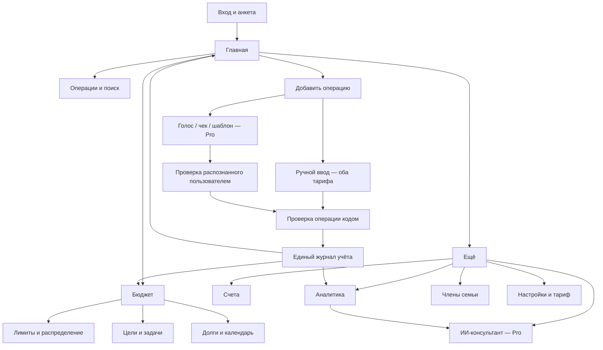

# FamCoin — полная карта продукта

Версия 1.1 · 22 сентября 2026 · iOS и Android · Казахстан · RU / ҚАЗ

Документ объединяет исходный запрос, оба предложенных плана и уточнения владельца продукта. Это спецификация для макета и разработки; реализация приложения ещё не выполнена. Продуктовые правила, предложенные в этом документе, можно менять без потери уже согласованной основы.

## 1. Зафиксированные решения и масштаб

**Согласовано:** название FamCoin; актуальная стабильная PostgreSQL как основная серверная база; две мобильные платформы; Казахстан; полноценные русский и казахский языки с переключателем в настройках; обычная бесплатная версия и Pro за **10 000 ₸ в год**; в обычной версии один денежный счёт и лимиты на две категории; платные средства быстрого ввода; семейные финансы ведёт один пользователь; код выполняет расчёты, ИИ помогает и консультирует; после трёх неверных вводов пароля блокировка на 15 минут.

**Рабочая спецификация:** 12 функциональных модулей, **96 пронумерованных возможностей**, **42 самостоятельных экрана**, **19 повторно используемых форм/панелей**, **9 шагов внутри одного экрана анкеты**. Числа относятся ко всей первой публичной версии с обычным тарифом и Pro. Шаги анкеты, состояния ошибок и формы не прибавляются к числу экранов. Возможность — пользовательский результат, иногда включающий несколько действий; это не количество API, кнопок или задач разработки.

В реестре **67 возможностей доступны в обоих тарифах**, некоторые с бесплатным ограничением; **29 возможностей открываются в Pro**. Из экранов 32 общие и 10 относятся к Pro. Это итог подсчёта конкретных строк ниже, а не предварительная оценка «примерно».

Для быстрого просмотра: раздел 2 — тарифы; 3–5 — навигация, экраны и функции; 6–9 — семья, данные, операции и формулы; 10–13 — ввод, ИИ, дизайн и архитектура; 14–19 — материалы, проверка, этапы и технические зависимости.

| Измерение | Решение |
|---|---|
| Тариф | Обычный или Pro; одна кодовая база и единая модель данных |
| Учёт | Личный или семейный; режим независим от тарифа |
| Семья | Один владелец учётной записи, справочник членов семьи, общие и персональные траты |
| Обычная версия | Достаточна для полноценного ручного учёта в пределах одного денежного счёта |
| Pro | Больше счетов и лимитов, автоматизация ввода, расширенные отчёты, консультант |
| Основная валюта | KZT по умолчанию; дополнительная валюта принадлежит конкретному счёту |
| Банки | Шаблоны названий и типов счетов Kaspi, Halyk, Freedom и других; наличие шаблона не означает подключение к банку |
| Работа без сети | Запись и просмотр локально сохранённых данных; сетевые функции показывают свою доступность |
| История | За весь срок использования, без платного ограничения количества операций |

Последовательные этапы разработки ниже — порядок сборки этой версии. Семейный режим, голос и чеки остаются в общей карте выпуска.

## 2. Тарифы и ограничения

| Возможность | Обычная, 0 ₸ | Pro, 10 000 ₸ / год |
|---|---|---|
| Ручные доходы, расходы, возвраты, корректировки | Без ограничения количества | Без ограничения количества |
| Активные денежные счета | 1 | Без тарифного ограничения количества |
| Категории и история | Без тарифного ограничения | Без тарифного ограничения |
| Активные лимиты | 2 категории | Без тарифного ограничения; дополнительные фильтры по счёту/члену семьи |
| Личный и семейный режим | Да | Да |
| Личные долги, кредиты, рассрочки | Да; ручной ввод и проведение платежей | Да; дополнительно сравнение сценариев погашения |
| График кредита и напоминания | Да | Да |
| Цели, задачи, ручное резервирование | Да | Да; дополнительно автоматические правила и прогноз достижения |
| Дневной ориентир трат и календарь обязательств | Да | Да |
| Отчёты по дням, месяцам, категориям, членам семьи | Да | Да |
| Сравнения, тенденции, прогнозы, история капитала | Нет | Да |
| Ручное разделение чека на категории | Да | Да |
| Голос, сканирование, автоматическая категоризация чека | Нет | Да, с квотами на платную обработку |
| Шаблоны и автоматическое создание плановых платежей | Нет | Да |
| ИИ-консультант и ежемесячный разбор | Нет | Да, с квотой |
| Краткие справочные материалы | Да | Да |
| Экспорт CSV и полный переносимый бэкап | Да | Да |
| Локальная работа, восстановление, базовая синхронизация | Да | Да |
| Русский, казахский, темы, безопасность | Да | Да |

Остальная детализация тарифов — предложение для реализации на основе согласованного принципа: платные функции сокращают действия и расширяют планирование. Точность учёта, исправление ошибок, поиск своей истории и доступ к своим данным доступны в обоих тарифах.

### 2.1 Что считается одним счётом

Один денежный счёт — один отдельный остаток в одной валюте: карта, наличные, текущий или депозитный счёт. Можно выбрать виртуальный «Общие деньги», если пользователь вручную ведёт общую сумму семьи. Он не показывает остатки отдельных банков.

Долги, кредитные обязательства, цели и справочные бонусные балансы не расходуют лимит денежного счёта. Бонусы нельзя использовать как обычные деньги в формулах ликвидности. Кредитный лимит не увеличивает доступные собственные средства.

Архивный счёт сохраняет историю и остаток. Закрытый счёт имеет нулевой остаток. Архивирование ненулевого счёта не удаляет деньги из итогов; пользователь видит, что такой остаток давно не сверялся.

### 2.2 Переход между тарифами

- При покупке Pro текущие данные сохраняются; открываются дополнительные возможности.
- При окончании Pro пользователь выбирает один счёт для новых операций и два активных лимита. Прочие счета доступны для чтения, выгрузки и анализа старой истории; их остатки помечены датой последнего обновления.
- Дневной ориентир после такого перехода рассчитывается по активному подтверждённому счёту. Замороженные остатки не выдаются за актуальные доступные деньги.
- Дополнительные лимиты и автоматические правила переходят в приостановленное состояние. Автоматизация не создаёт скрытых записей.
- Повторная подписка возвращает доступ к сохранённым объектам. Автоматизации включаются явно, без массового проведения пропущенных платежей.
- Отмена продления не равна немедленному окончанию уже оплаченного периода. Окончательная дата доступа приходит из подтверждённого статуса покупки.

На экране тарифа: **«10 000 ₸ / год»**, подпись **«≈ 833 ₸ в месяц при оплате за год»**. Месячного тарифа в текущей карте нет. Автопродление, пробный период и конкретные квоты пока не согласованы. Фактические условия и цена покупки должны отображаться из настроенного продукта магазина, без расхождения с рекламной подписью.

## 3. Навигация и основные пути

Предложение: четыре раздела и отдельное центральное действие в нижней панели:

```text
Главная       Операции       ＋       Бюджет       Ещё
```

«＋» открывает форму добавления, не переключает вкладку. Голос и чек доступны явно подписанными кнопками внутри формы; длинное нажатие может быть дополнительным ускорением. Важные функции не зависят от знания скрытого жеста.



| Элемент | Место и причина | Результат |
|---|---|---|
| Добавить | Центр нижней панели; основное частое действие | Ручная форма за одно нажатие |
| Голос / чек | Рядом с полями ввода; это способы заполнить ту же операцию | Распознанный черновик, затем подтверждение |
| Поиск и фильтр | Вверху журнала | Поиск конкретной траты без перехода в настройки |
| Период отчёта | В заголовке отчёта | Период меняется рядом с результатом |
| Счета | Лента на главной и пункт «Ещё» | Проверка остатка и переход к истории |
| Все платежи | Рядом с ближайшими платежами на главной | Календарь и контроль обязательств |
| Аналитика | Видимая ссылка «Отчёт за месяц» на главной и пункт «Ещё» | Текущий отчёт одним нажатием с главной |
| Цели / долги | Карточки бюджета, ближайший долг также на главной | Связь обязательств с планированием денег |
| Объяснить | У конкретного показателя с меткой Pro | Чат с выбранным периодом и контекстом |
| Сохранить | В нижней части формы над клавиатурой | Явное завершение записи, защита от двойной отправки |
| Редактировать / удалить | Карточка операции, удаление в меню | Исправление с сохранением истории |
| Язык / тема | Настройки; язык также на первом запуске | Доступность приложения до регистрации |
| Pro | Настройки и точка запуска закрытой функции | Понятно, какая возможность открывается |

Главная сверху вниз: дневной ориентир и его основание → актуальные счета → ближайшие обязательства → лимиты с риском → отчёт за месяц → последние операции. Первым показывается проблема с данными или дефицит, если корректный дневной ориентир сейчас невозможен.

## 4. Реестр экранов

«Оба» означает доступность основной функции в обоих тарифах. Платные дополнительные действия могут находиться внутри общего экрана. При обращении к закрытой возможности используется единый S37.

| ID | Экран | Доступ | Основная задача / переход |
|---|---|---|---|
| S01 | Приветствие и язык | Оба | Выбрать RU / ҚАЗ, перейти ко входу или регистрации |
| S02 | Регистрация | Оба | Создать учётную запись |
| S03 | Вход | Оба | Войти, увидеть таймер блокировки |
| S04 | Подтверждение контакта | Оба | Подтвердить выбранный контакт |
| S05 | Восстановление доступа | Оба | Запросить восстановление и установить пароль |
| S06 | Анкета | Оба | Девять шагов с сохранением прогресса |
| S07 | Главная | Оба | Понять текущее положение и записать операцию |
| S08 | Список счетов | Оба | Остатки, активность, создание счёта |
| S09 | Счёт и история | Оба | Проверить операции и сверить остаток |
| S10 | Журнал операций | Оба | Найти запись за любой период |
| S11 | Карточка операции | Оба | Детали, связанные записи, исправление |
| S12 | Бюджет периода | Оба | План, факт, выплаты и свободное распределение |
| S13 | Лимиты | Оба | Управлять двумя или большим числом ограничений |
| S14 | Метод и распределение бюджета | Оба | Выбрать подход и распределить средства |
| S15 | Календарь платежей | Оба | Планы, сроки, подтверждение факта оплаты |
| S16 | Цели | Оба | Список целей и резервов |
| S17 | Цель и задачи | Оба | Прогресс, взносы, связанные действия |
| S18 | Долги и кредиты | Оба | Я должен / мне должны / банки |
| S19 | Кредит, рассрочка, кредитка | Оба | Задолженность, график, платежи |
| S20 | Личный долг | Оба | Выдача, получение, частичные возвраты |
| S21 | Досрочное погашение | Pro | Сравнить срок, платёж и стоимость |
| S22 | Стратегия погашения долгов | Pro | Сравнить лавину и снежный ком |
| S23 | Аналитика периода | Оба | Дни, месяцы, категории, денежные выплаты |
| S24 | Категория в деталях | Оба | Сумма и составляющие её операции |
| S25 | Сравнения и тенденции | Pro | Сопоставимые периоды и аномалии |
| S26 | Капитал и его история | Pro | Изменение учтённых активов и обязательств |
| S27 | ИИ-консультант | Pro | Вопросы по проверенным данным |
| S28 | Ежемесячный разбор | Pro | Изменения, причины, предложения |
| S29 | Ещё | Оба | Каталог остальных разделов |
| S30 | Семья | Оба | Справочник людей и семейные разрезы |
| S31 | Профиль и настройки | Оба | Язык, тема, режим учёта, параметры |
| S32 | Безопасность | Оба | PIN, биометрия, сессии, смена пароля |
| S33 | Категории | Оба | Создание, архивирование, объединение |
| S34 | Уведомления | Оба | Сроки, пороги и тихие часы |
| S35 | Данные и синхронизация | Оба | Статус, конфликты, экспорт, бэкап, удаление аккаунта |
| S36 | Корзина | Оба | Восстановить ошибочно удалённое |
| S37 | Тариф и подписка | Оба | Сравнение, покупка, восстановление, управление |
| S38 | Голосовой ввод | Pro | Запись, текст, распознанные поля |
| S39 | Сканирование чека | Pro | Камера, QR / OCR, проверка позиций |
| S40 | Шаблоны | Pro | Быстрые операции и правила повторения |
| S41 | Словарь распознавания | Pro | Личные слова, магазины и исправления |
| S42 | Справка и финансовые материалы | Оба | Короткие статьи с источником и датой проверки |

Текущий учтённый капитал доступен в бесплатной сводке S07/S23. S26 добавляет именно подробную историю и разложение изменений.

### 4.1 Формы и панели

| ID | Форма / панель | Использование |
|---|---|---|
| Q01 | Создание / изменение счёта | S06, S08, S09 |
| Q02 | Ручная операция | Глобальная кнопка «＋», S09, S10 |
| Q03 | Перевод / обмен | S08, S09, Q02; Pro |
| Q04 | Разделение суммы по категориям | Q02, S11, S39 |
| Q05 | Полный / частичный возврат | S11 |
| Q06 | Начальный остаток / сверка | S06, S09 |
| Q07 | Категория | S33, Q02 |
| Q08 | Лимит | S13, S24 |
| Q09 | Цель | S16, S17 |
| Q10 | Резервирование / освобождение денег | S17 |
| Q11 | Долг / кредит / рассрочка | S06, S18 |
| Q12 | Погашение / частичный возврат долга | S19, S20 |
| Q13 | Правило распределения | S14; автоматическое применение — Pro |
| Q14 | Плановый платёж | S15; повторение — Pro |
| Q15 | Фильтры журнала и отчётов | S10, S23, S24 |
| Q16 | Член семьи | S06, S30 |
| Q17 | Шаблон | S40; Pro |
| Q18 | Задача цели | S17 |
| Q19 | Прочий актив / оценка стоимости | S23, S26 |

### 4.2 Анкета: девять шагов внутри S06

1. Личный или семейный режим. Для семьи — имена/обозначения, без приглашений.
2. Основная валюта и представление сумм.
3. Первый денежный счёт, начальный остаток и дата начала учёта. Добавление второго требует Pro.
4. Банковские кредиты, рассрочки, кредитные обязательства: остаток на дату начала учёта.
5. Личные долги в обе стороны.
6. Зарплата «на руки», аванс и ожидаемые даты. Ожидаемый доход не становится фактическим.
7. Обязательные платежи, сроки, суммы и уже оплаченные обязательства периода.
8. Метод бюджета, до двух лимитов в обычной версии, первая цель по желанию.
9. Сводка введённых данных, незаполненные поля, первая ручная операция.

Шаги можно пропускать. До первой проведённой денежной операции требуется выбрать или создать счёт. Если для показателя не хватает данных, показываем причину, а не выдуманное число. Заполнение сохраняется между запусками.

## 5. Реестр 96 функций

Обозначения: **Б** — оба тарифа; **П** — Pro. Формулировки с ограничениями явно описывают бесплатную часть. В каждом модуле восемь возможностей; номера позволяют ссылаться на конкретный объём работы.

| Модуль | Диапазон возможностей |
|---|---|
| Доступ и безопасность | F001–F008 |
| Подготовка, семья и локализация | F009–F016 |
| Счета и активы | F017–F024 |
| Запись операций | F025–F032 |
| Журнал и порядок в истории | F033–F040 |
| Бюджет и обязательства | F041–F048 |
| Цели и задачи | F049–F056 |
| Долги и кредиты | F057–F064 |
| Аналитика | F065–F072 |
| Быстрый ввод | F073–F080 |
| ИИ-консультант | F081–F088 |
| Настройки, данные и подписка | F089–F096 |

| ID | Возможность и результат | Тариф | Основные экраны |
|---|---|---|---|
| F001 | Регистрация по выбранному логину и паролю | Б | S02 |
| F002 | Подтверждение контакта | Б | S04 |
| F003 | Вход с серверным учётом неудачных попыток | Б | S03 |
| F004 | Блокировка после трёх ошибок на 15 минут и таймер | Б | S03 |
| F005 | Восстановление доступа и смена пароля | Б | S05, S32 |
| F006 | Локальный PIN и биометрическое открытие | Б | S32 |
| F007 | Автоблокировка и скрытие содержимого в переключателе приложений | Б | S32 |
| F008 | Просмотр сессий, выход и завершение сессии | Б | S32 |
| F009 | Пошаговая анкета с продолжением позже | Б | S06 |
| F010 | Выбор и смена личного / семейного режима без удаления истории | Б | S06, S31 |
| F011 | Справочник членов семьи, добавление и архивирование | Б | S30 |
| F012 | Отнесение дохода или расхода к человеку / общим нуждам | Б | S10, S30 |
| F013 | Полная локализация RU / ҚАЗ и переключение без перезапуска | Б | S01, S31 |
| F014 | Валюта отчётов, формат дат и сумм | Б | S06, S31 |
| F015 | Ожидаемые доходы, аванс и даты без изменения баланса | Б | S06, S15 |
| F016 | Выбор метода бюджета и стартовых настроек | Б | S06, S14 |
| F017 | Создание, редактирование и выбор одного денежного счёта | Б | S08, S09 |
| F018 | Одновременное ведение нескольких денежных счетов | П | S08 |
| F019 | Остаток и история каждого доступного счёта | Б | S09 |
| F020 | Перевод между своими денежными счетами | П | S09 |
| F021 | Обмен валюты с двумя суммами и отдельной комиссией | П | S09 |
| F022 | Сверка, доступность денег и дата актуальности остатка | Б | S09 |
| F023 | Справочный бонусный баланс и его использование | Б | S09, S23 |
| F024 | Ручная оценка прочих активов отдельно от денег | Б | S23 |
| F025 | Ручной расход с категорией, датой и счётом | Б | S10 |
| F026 | Ручной доход с источником и датой | Б | S10 |
| F027 | Разделение одной покупки на несколько категорий | Б | S11 |
| F028 | Полный и частичный возврат с привязкой к покупке | Б | S11 |
| F029 | Денежный кешбэк и начисленные проценты по депозиту | Б | S09, S10 |
| F030 | Начальный остаток и объяснимая корректировка | Б | S09 |
| F031 | Отдельные состояния плана, черновика и проведённой операции | Б | S11, S15 |
| F032 | Исправление, отмена и история изменений записи | Б | S11 |
| F033 | Полная история и постраничная загрузка | Б | S10 |
| F034 | Фильтры по датам, суммам, категориям, счетам и семье | Б | S10 |
| F035 | Поиск по заметкам, продавцам и названиям | Б | S10 |
| F036 | Связанные записи: покупка, возвраты, долг, платёж | Б | S11 |
| F037 | Архивирование счетов и категорий с сохранением истории | Б | S08, S33 |
| F038 | Объединение дублей категорий с предварительным просмотром | Б | S33 |
| F039 | Предупреждение о похожих операциях без автоматического удаления | Б | S11, S35 |
| F040 | Корзина и восстановление удалённого | Б | S36 |
| F041 | План и факт бюджета с раздельными расходами и выплатами | Б | S12 |
| F042 | Лимиты на две категории; больше категорий в Pro | Б | S13 |
| F043 | Лимиты по счёту/члену семьи и несколько условий | П | S13 |
| F044 | Пороги 80% / 100% и предупреждение о превышении | Б | S07, S13 |
| F045 | Ручной календарь обязательств и напоминания | Б | S15 |
| F046 | Дневной ориентир трат с раскрытием расчёта | Б | S07 |
| F047 | Ручное применение выбранного метода распределения | Б | S14 |
| F048 | Автоматическое создание плановых платежей по правилам | П | S15, S40 |
| F049 | Создание целей с суммой, валютой и сроком | Б | S16 |
| F050 | Резервирование денег на счёте для цели | Б | S17 |
| F051 | Освобождение резерва без фиктивного дохода | Б | S17 |
| F052 | Прогресс и требуемый плановый взнос | Б | S17 |
| F053 | Задачи цели с датой и отметкой выполнения | Б | S17 |
| F054 | История резервирования и связанных трат | Б | S17 |
| F055 | Прогноз достижения по фактическим пополнениям | П | S17 |
| F056 | Правила «процент дохода» и округления покупок | П | S14, S17 |
| F057 | Личный долг «я должен» / «мне должны» | Б | S18, S20 |
| F058 | Частичное погашение с разделением тела и процентов | Б | S20 |
| F059 | Кредит и исходная задолженность без фиктивного дохода | Б | S19 |
| F060 | Рассрочка: покупка, долг и отдельные выплаты | Б | S19 |
| F061 | Кредитная карта: покупки, долг, лимит, даты платежей | Б | S19 |
| F062 | График, ближайший платёж и напоминания | Б | S19, S15 |
| F063 | Сценарии досрочного погашения | П | S21 |
| F064 | Лавина / снежный ком при заданном бюджете выплат | П | S22 |
| F065 | Доходы, расходы и денежные выплаты за выбранный период | Б | S23 |
| F066 | Категории, дни и переход к исходным операциям | Б | S23, S24 |
| F067 | Семейные разрезы и общий бюджет | Б | S23, S30 |
| F068 | Текущий учтённый капитал, резерв и долговая нагрузка | Б | S07, S23 |
| F069 | Сравнение сопоставимых периодов | П | S25 |
| F070 | Прогноз денежных остатков по датам | П | S25 |
| F071 | Поиск аномалий и предполагаемых повторяющихся списаний | П | S25 |
| F072 | История капитала и разложение его изменений | П | S26 |
| F073 | Голосовой ввод на русском и казахском | П | S38 |
| F074 | Разбор суммы, даты, счёта, категории и человека | П | S38 |
| F075 | Стартовый словарь повседневных покупок | П | S41 |
| F076 | Личные правила по подтверждённым исправлениям | П | S41 |
| F077 | Чтение QR поддерживаемых чеков ОФД Казахстана | П | S39 |
| F078 | Распознавание фото чека и проверка суммы позиций | П | S39 |
| F079 | Подтверждение одного или нескольких распознанных черновиков | П | S38, S39 |
| F080 | Создание шаблонов и выбор частых операций | П | S40 |
| F081 | Чат-консультант на выбранном языке | П | S27 |
| F082 | Объяснение показателя и составляющих расчёта | П | S27 |
| F083 | Проверка сценария покупки или цели через расчётный модуль | П | S27 |
| F084 | Ежемесячный разбор с переходами к исходным отчётам | П | S28 |
| F085 | Объяснение выявленных кодом аномалий и подписок | П | S27 |
| F086 | Подбор метода бюджета с объяснением ограничений | П | S27 |
| F087 | Предложение изменений с просмотром и подтверждением | П | S27 |
| F088 | Квоты ИИ, повтор запроса и контроль отправляемого контекста | П | S27, S37 |
| F089 | Темы, размер текста и читаемое отображение сумм | Б | S31 |
| F090 | Уведомления, расписание и тихие часы | Б | S34 |
| F091 | Работа с локальной базой и синхронизация устройств владельца | Б | S35 |
| F092 | Экспорт CSV и резервное копирование / восстановление | Б | S35 |
| F093 | Состояние данных, разрешение конфликтов и удаление аккаунта | Б | S35 |
| F094 | Справочные статьи с источниками и датой проверки | Б | S42 |
| F095 | Покупка Pro, восстановление и просмотр срока доступа | Б | S37 |
| F096 | Управление подпиской и сохранение данных при смене тарифа | Б | S37 |

## 6. Семейный учёт одним человеком

Владелец записывает финансы всей семьи. `FamilyMember` — справочная запись, у неё нет пароля, приглашения или прав доступа. Синхронизация относится к собственным устройствам владельца.

Операция содержит распределение «Для кого»: общее / конкретный человек / несколько людей. Для нескольких людей сумма долей равна сумме операции. Категория отвечает на вопрос «на что», семейная метка — «для кого»; эти разрезы не заменяют друг друга. Для дохода можно указать, чей это доход. Автор технической записи всегда один владелец.

Пример: покупка продуктов на 12 000 ₸ — общая; школьная одежда на 18 000 ₸ — ребёнку; зарплата супруги на 300 000 ₸ — её источник семейного дохода. В сводке одна и та же покупка учитывается один раз, даже когда одновременно показаны категории и люди.

Передача денег между членами одного учитываемого семейного бюджета сама по себе не является расходом семьи. При счёте «Общие деньги» выдача ребёнку наличных меняет назначение денег, а расход появляется при покупке. При отдельных счетах это внутренний перевод. Средства, окончательно переданные за пределы учитываемого бюджета, классифицируются по смыслу: подарок, помощь или долг.

Смена личного режима на семейный сохраняет старые записи без семейной метки. Обратная смена скрывает семейные поля, сохраняя данные. Архивирование человека не удаляет его историю. Задачи вроде «оплатить кружок» остаются задачами владельца, а не поручениями другим аккаунтам.

## 7. Модель данных и правила целостности

| Сущность | Назначение и связи |
|---|---|
| User | Контакт, локаль, настройки безопасности |
| LedgerSpace | Один журнал владельца; режим personal / family, валюта отчётов, часовой пояс |
| Subscription / Entitlement | Подтверждённый срок Pro и доступные возможности; независимы от журнала |
| FamilyMember | Справочник людей внутри журнала |
| MoneyAccount | Денежный актив, валюта, ликвидность, состояние, дата сверки |
| Transaction / Posting | Операция и атомарный набор её учётных записей |
| Category / Split | Категория, назначение и доли одной операции |
| Counterparty | Магазин, банк, человек; связь с поиском и долгом |
| Debt / DebtEvent | Требование к человеку или обязательство; изменения основного долга и процентов |
| LoanSchedule / Installment | Ожидаемые суммы и сроки; ссылки на реальные платежи |
| Goal / Reservation | Цель и привязанный к конкретным деньгам резерв |
| GoalTask | Задача со сроком; отметка выполнения сама не создаёт финансовую операцию |
| Budget / Limit / Allocation | План периода, ограничение категории, распределение денег |
| PlannedPayment / RecurrenceRule | Плановый платёж и правило появления следующего плана |
| BonusWallet | Баллы/бонусы с ограничениями использования; отдельно от денег |
| Asset / Valuation | Прочий актив и ручные оценки: например, автомобиль или жильё |
| ExchangeRate | Валютная пара, значение, источник и дата курса |
| Receipt / Attachment | Исходный чек, результат распознавания, связь с одной покупкой |
| VoiceDictionary / Template | Персональные слова и шаблоны ввода |
| DailyAggregate / MonthlyAggregate | Восстанавливаемые производные показатели |
| AuditEvent / SyncMutation | История правок, версия, идентификатор повторяемой команды |
| AIConversation / AIUsage | Сообщения, ссылки на расчёты, использование квот |

### 7.1 Как хранится финансовая правда

Источник остатков — проведённые учётные записи. Начальный остаток оформляется отдельным событием на конкретную дату и не прибавляется вторым полем поверх этих записей. Для скорости разрешены кеши остатков и агрегаты, которые можно пересчитать и сверить с журналом.

Рекомендуется внутренний журнал двойной записи: денежные активы, требования, обязательства, доходы, расходы и технические счета. Пользователь видит привычные расходы и переводы. Тарифный лимит относится только к пользовательским денежным счетам, а не к техническим счетам этого журнала.

Перевод, покупка в кредит и платёж по кредиту записываются целиком одной транзакцией базы. Для обмена валют используется согласованная оценка в валюте отчётности и технические валютные записи; складывать 100 000 тенге и 190 долларов как однородные суммы нельзя.

Обязательные свойства реализации:

- Денежные суммы — целые минимальные единицы валюты: для KZT тиыны. Курс и проценты — decimal с определённой точностью. Правило округления едино, остаток округления явно распределяется.
- Сумма частей покупки, её категорий и семейного распределения соответствует общей сумме. Родительская сумма и дочерние части не складываются повторно в аналитике.
- У команды уникальный идентификатор. Повтор сети, нажатия или синхронизации возвращает уже созданный результат.
- У операции есть дата факта, дата создания, часовой пояс и версия. Изменение системного часового пояса телефона не переносит старую покупку на другой день отчёта.
- Состояния: черновик, план, проведено, отменено. Только актуальный проведённый эффект входит в баланс. История версий хранится отдельно от суммирования.
- Удаление/восстановление связанных записей проверяет возвраты, долг и резервы; изменение всех последствий атомарно.
- Возврат сверх невозвращённой суммы покупки требует отдельного объяснимого типа события. Отрицательные суммы не используются для обхода правил обычного расхода.
- Корректировка сохраняет причину и изменяет капитал через отдельную строку сверки; она не скрывается как обычный доход.
- Учётные суммы локального и серверного модулей сверяются на одном наборе контрольных примеров.

## 8. Виды финансовых событий

Ниже 24 типа событий модели. Пользователь не видит 24 равнозначные кнопки: основная форма предлагает «Расход», «Доход», «Перевод», «Долг», а специальные действия открываются из соответствующего объекта. Разделённый чек — структура одной покупки, а не дополнительный расход.

| ID | Событие | Деньги | Расход / доход | Прочий эффект |
|---|---|---|---|---|
| O01 | Покупка за свои деньги | − сумма | Расход + сумма | Категория, лимит, семейное распределение |
| O02 | Доход | + сумма | Доход + сумма | Источник дохода |
| O03 | Перевод между своими счетами | − A, + B | Нет | Комиссия отдельным O22 |
| O04 | Обмен валюты | − валюта A, + валюта B | Нет обычного расхода | Две фактические суммы, курс, комиссия, курсовой результат |
| O05 | Зарезервировать для цели | Без изменения | Нет | Свободная часть денег уменьшается |
| O06 | Освободить резерв цели | Без изменения | Нет | Свободная часть увеличивается |
| O07 | Дать в долг | − сумма | Нет | Требование «мне должны» + сумма |
| O08 | Взять личный долг | + сумма | Нет | Обязательство + сумма |
| O09 | Получить возврат личного долга | + сумма | Только полученные проценты — доход | Требование уменьшается на тело |
| O10 | Вернуть личный долг | − сумма | Только проценты/комиссии — расход | Обязательство уменьшается на тело |
| O11 | Получить денежный кредит | + сумма | Нет | Обязательство + сумма |
| O12 | Платёж по кредиту | − вся выплата | Проценты и комиссии | Тело уменьшает обязательство |
| O13 | Покупка в рассрочку / кредитной картой | Только первоначальный взнос, если есть | Полная стоимость потребительской покупки | Обязательство + непогашенная часть |
| O14 | Погашение рассрочки / кредитной карты | − выплата | Только дополнительные проценты/комиссии | Тело уменьшает обязательство |
| O15 | Возврат покупки | + деньги либо уменьшение обязательства | Уменьшение расхода исходной категории | Связь с покупкой и способом её оплаты |
| O16 | Денежный кешбэк | + сумма | Доход «Кешбэк» | Учитывается после реального зачисления |
| O17 | Начисление бонусов | Денежные счета без изменения | Не денежный доход | Бонусный остаток + баллы |
| O18 | Использование бонусов | Уменьшается только денежная часть оплаты | Расход в принятой модели равен денежной/кредитной части | Бонусы − баллы; полная цена видна в чеке |
| O19 | Проценты по депозиту | + фактическое зачисление | Доход «Проценты» | Прогноз процентов не равен зачислению |
| O20 | Начальные остатки денег / активов / долгов | Исходное состояние | Нет дохода/расхода текущего периода | Начальный капитал на дату начала учёта |
| O21 | Сверка и корректировка | ± разница | Отдельная корректировка | Причина и изменение капитала |
| O22 | Комиссия | − деньги либо + обязательство | Расход «Комиссии» | Связь с переводом/кредитом/обменом |
| O23 | Покупка учитываемого актива | − деньги либо + обязательство | Не потребительский расход | Актив + стоимость; например, учтённое жильё |
| O24 | Новая оценка актива / валютного остатка | Без реального движения денег | Отдельное изменение оценки | Влияет на учтённый капитал |

**Особые правила:**

- Покупка в рассрочку на 240 000 ₸ создаёт расход 240 000 ₸ и долг 240 000 ₸. Позднейшая выплата 20 000 ₸ создаёт денежный отток и снижает долг до 220 000 ₸, без повторного расхода.
- Покупку жилья, если жильё учитывается в активах, проводят O23, а не одновременно O01/O13 на ту же сумму. Иначе капитал будет искажён. Упрощённый учёт без жилья возможен, но показатель называется «Учтённый капитал» и объясняет неполноту.
- Возврат кредитной покупки может уменьшать задолженность без зачисления денег. Способ возврата выбирается явно.
- Частичный возврат разделённого чека относится к конкретным позициям/категориям. По умолчанию он уменьшает расходы в дату возврата; исходная покупка остаётся в своей дате.
- Если пользователь сначала оплатил общую покупку за друга, выделенная доля друга сразу становится требованием. Её последующий возврат не становится доходом. Автоматический сервис разделения между друзьями пока не входит в выпуск.
- Для бонусов выбрана простая политика: баллы не включаются в капитал и доход; расход покупки считается за вычетом использованных баллов. Денежный кешбэк остаётся доходом. Политику нельзя менять от чека к чеку.

Kaspi прямо указывает, что бонусы нельзя обналичить. Поэтому они отделены от ликвидных денег. [Kaspi Гид](https://guide.kaspi.kz/client/ru/bonus/spending/q543).

## 9. Расчётная модель

Все формулы ниже реализуются кодом с одинаковыми правилами для обычного тарифа и Pro. Платным может быть интерфейс сценария или автоматизация, но не достоверность результата.

### 9.1 Балансы, капитал и свободные средства

```text
Баланс счёта = сумма проведённых изменений, включая событие начального остатка
Денежные активы = сумма уникальных денежных счетов в валюте отчёта
Активы = денежные активы + требования «мне должны» + оценки прочих активов
Обязательства = непогашенное тело долгов + отдельно учтённые начисленные суммы к оплате
Учтённый капитал = Активы − Обязательства

Ликвидные собственные деньги = доступные для трат положительные остатки
  выбранных актуальных денежных счетов
Свободные ликвидные = Ликвидные собственные деньги − защищённые резервы внутри них
```

Депозит — разновидность денежного счёта, его нельзя прибавить повторно. Цель — назначение денег, её нельзя прибавить к активам. Неиспользованный кредитный лимит исключён из активов и ликвидности. Овердрафт учитывается как обязательство, а не как отрицательный актив второй раз.

Резерв на неликвидном депозите не вычитается повторно из ликвидных средств, куда этот депозит уже не входит. Суммарные резервы счёта не могут превышать его доступный положительный остаток без явного сообщения о дефиците резервов.

### 9.2 Три разных отчёта

```text
Доход периода = зарплата + прочие доходы + денежный кешбэк
             + зачисленные проценты + полученные проценты по личным долгам

Расход периода = признанные потребительские покупки, включая кредитные
              + признанные проценты и комиссии − возвраты покупок

Результат доходов и расходов = Доход периода − Расход периода

Чистый денежный поток = все реальные входящие − все реальные исходящие
  через выбранную границу денежных счетов
```

Перевод внутри выбранного набора счетов взаимно обнуляется. Перевод из ликвидного набора на недоступный для трат депозит уменьшает ликвидность, хотя не является расходом. Выдача долга и погашение тела кредита входят в денежный поток, но не в расход потребления.

Дополнительно показывается изменение учтённого капитала: доходы/расходы, корректировки, оценки и курсовые эффекты. Начальные остатки не смешиваются с доходами выбранного периода.

### 9.3 Дневной ориентир трат

Пользовательский текст: **«Ориентир на сегодня»**, с пояснением периода и исходных данных. Это оценка на основе записанного плана. Код не считает неизвестную зарплату гарантированным поступлением.

Для простого периода без поступлений до его конца:

```text
L0 = актуальные ликвидные собственные деньги на начало дня
R0 = уже защищённые резервы внутри L0
C0 = ещё не оплаченные обязательства периода из свободных денег
P0 = ещё не выполненный план новых накоплений периода
D  = число дней периода, включая сегодня, минимум 1
B0 = L0 − R0 − C0 − P0
Дневной бюджет = max(0, B0 / D)
Осталось сегодня = Дневной бюджет − сегодняшние траты из этого дневного бюджета
```

Обязательство, уже покрытое вычтенным резервом, не вычитается второй раз в C0. Уже выполненное накопление не входит в P0. Оплата заранее зарезервированного обязательства не становится ещё одной тратой из дневного бюджета. Покупка на средства цели списывает соответствующий резерв атомарно.

Проверка: 100 000 ₸ утром, 10 дней, нет резервов и обязательств → 10 000 ₸ в день. Покупка на 2 000 ₸ → остаток дня **8 000 ₸**, независимо от того, что текущий банковский остаток уже равен 98 000 ₸.

Для нескольких поступлений и крупных платежей код проверяет последовательность дат. Маленький аванс завтра не должен освобождать деньги, необходимые для аренды после завтра. Рабочий горизонт — до следующего основного дохода с проверкой ближайшего полного платёжного цикла; при отсутствии даты пользователь задаёт период.

Обобщённый расчёт постоянного дневного бюджета: для каждой контрольной точки t определить свободный остаток A(t) без повседневных трат, учитывая запланированные поступления, выплаты и новые резервы ровно по одному разу. Затем взять:

```text
Дневной бюджет = max(0, min по t [ A(t) / N(t) ])
N(t) = количество дней повседневных трат от начала расчёта до t
```

Проверяются окончания дней и моменты крупных обязательств. Если порядок поступления и списания в один день неизвестен, используется осторожный вариант со списанием раньше поступления. При отрицательном A(t) показываем дефицит и его дату. При новых существенных данных пересчёт объясняется пользователю; сегодняшние фактические траты сохраняются и не вычитаются дважды.

### 9.4 Бюджет и лимиты

```text
Расход категории = сумма её частей проведённых покупок − относящиеся к ней возвраты
Использовано, % = Расход категории / Лимит × 100, если Лимит > 0
Остаток лимита = Лимит − Расход категории
Линейный ориентир к концу = Расход / Число прошедших полных дней × Дней в периоде
```

Линейный прогноз обозначается как приблизительный, не применяется при отсутствии полных дней и не выдаёт равномерность расходов за факт. Для аренды или разовых покупок предпочтителен календарь. Нулевой лимит означает «любая трата вызывает предупреждение», а не деление на ноль. Отрицательный расход категории после возврата показывается явно.

Лимиты по категории, человеку и счёту могут пересекаться. Одна покупка проверяется против каждого применимого лимита, но общий расход не получается суммированием использований всех лимитов. Бесплатные два лимита — две категории с выбранным периодом день/неделя/месяц. Предупреждение никогда не запрещает записать уже совершённую реальную покупку.

### 9.5 Методы бюджета

| Подход | Реализация |
|---|---|
| Просто учёт | Нет обязательного распределения; расходы и денежные выплаты доступны отдельно |
| Лимиты категорий | Планируется выбранный потолок расходов |
| 50/30/20 | От чистого дохода «на руки»: нужды 50%, желания 30%, накопления/дополнительное погашение долгов 20%; доли редактируемы |
| Конверты | Реально доступная сумма распределяется между назначениями, включая резерв и долги; нераспределённый остаток виден |
| Сначала себе | Заданный процент полученного дохода резервируется; оставшаяся часть распределяется на обязательства и траты |

Нулевое нераспределённое значение — цель метода конвертов, а не условие сохранения формы. Ожидаемый доход отмечается отдельно от денег, уже доступных для распределения. Конверт и цель не создают новые активы. Изменение метода действует на выбранный период и не переписывает историю. Лавина и снежный ком — стратегии долгов, а не ещё два метода общего бюджета.

50/30/20 используется как изменяемый стартовый шаблон, а не универсальная норма. [Учебный материал CFPB](https://files.consumerfinance.gov/f/documents/cfpb_building_block_activities_analyzing-budgets_worksheet.pdf).

### 9.6 Цели и копилки

```text
Накоплено = действующие резервы, привязанные к цели
Прогресс = Накоплено / Целевая сумма × 100, если Целевая сумма > 0
Осталось = max(0, Целевая сумма − Накоплено)
Требуемый взнос = Осталось / Число запланированных дат пополнения до срока
Месяцев до цели = Осталось / Среднее чистое пополнение за полный месяц
Округление покупки = ceil(Сумма / Шаг) × Шаг − Сумма
```

Прогноз даты добавляет месяцы к дате, а не трактует их как дни. Если средний взнос ≤ 0, истории недостаточно или срок прошёл, показывается соответствующее состояние. Прогресс может быть больше 100%, остаток к накоплению — не меньше нуля.

Шаг округления для KZT предлагается 100 / 500 / 1 000 ₸. Это резервирование в учёте; приложение не переводит реальные деньги в банке. Автоматическое резервирование не уводит свободные средства в минус. При возврате покупки связанное округление пересчитывается. При расходовании цели резерв уменьшается, а сама покупка остаётся обычным расходом или приобретением актива согласно её сути.

### 9.7 Кредиты и досрочное погашение

```text
S = основная сумма, i = номинальная годовая ставка в долях, r = i / 12
n = число оставшихся ежемесячных платежей
Если r = 0: A = S / n
Если r > 0: A = S × r / (1 − (1 + r)^(-n))
Проценты периода = Остаток до платежа × r
Тело платежа = A − Проценты периода
Новый остаток = Старый остаток − Тело платежа − Досрочное погашение тела
```

Это модель равных месячных периодов с фиксированной номинальной ставкой. Дневное начисление, даты, страховки и комиссии определяются договором. Введённый банковский график приоритетнее приблизительного модельного графика; источник графика виден пользователю. ГЭСВ не подставляется вместо i.

Ожидаемые проценты графика не становятся фактическим расходом автоматически. Если комиссия или проценты уже признаны отдельной записью с увеличением задолженности, их последующая оплата погашает эту задолженность и не создаёт расход второй раз.

```text
B = остаток тела непосредственно после досрочного погашения
При сохранении платежа A, r > 0 и A > B×r:
n' = −ln(1 − B×r/A) / ln(1+r)
При r = 0: n' = B / A
Новый платёж при сохранении срока = аннуитет(B, r, оставшееся n)
```

Окончательный календарь строится по периодам с округлениями и последним неполным платежом. При A ≤ B×r модель не погашает долг; вместо числа показывается причина. Экономия сравнивает будущие проценты и сопоставимые дополнительные расходы двух графиков с одной даты; внесённое тело не называется экономией.

Для дифференцированных выплат тело равно S/n, проценты считаются на остаток. Для кредиток минимальный платёж и льготный период задаются условиями конкретного продукта, универсальная аннуитетная формула к ним не применяется. Для уже существующего кредита вводится текущая задолженность: прошлое получение кредита не создаёт новое поступление денег сегодня.

Лавина сортирует допустимые долги по стоимости/ставке, снежный ком — по остатку. Минимальные обязательные платежи учитываются по всем долгам; дополнительная сумма направляется по выбранной очереди. Расчёт сравнивает одинаковый бюджет выплат. [CFPB о стратегиях](https://www.consumerfinance.gov/archive/blog/how-reduce-your-debt/), [калькуляторы АРРФР](https://www.gov.kz/memleket/entities/ardfm/press/article/details/181561?lang=ru).

### 9.8 Валюты и показатели состояния

Для исторических доходов и расходов фиксируется курс даты операции. Для капитала на дату отчёта используется курс этой даты, а не единый старый курс покупки. Сохраняются фактические суммы обмена и источник справочного курса; при устаревшем курсе видна дата.

Рабочая политика стоимости валютного остатка — средневзвешенная стоимость по счёту. Покупки увеличивают валютную сумму и её стоимость в KZT; расход/продажа списывает соответствующую долю стоимости. Перевод между своими валютными счетами переносит стоимость и сам не создаёт курсовой доход. Реализованный результат обмена и переоценка оставшейся валюты показываются отдельно от бытовых расходов.

```text
Нереализованная переоценка = Валютный остаток × Курс отчёта − Его остаточная стоимость
Доля результата доходов/расходов = (Доход − Расход) / Доход × 100, если Доход > 0
Доля фактически направленного на накопления = Чистые взносы из дохода / Доход × 100
Покрытие резервом, месяцев = Доступный аварийный резерв / Средние необходимые выплаты
Бытовая долговая нагрузка = Обязательные месячные выплаты по долгам / Чистый доход × 100
```

Перевод старых накоплений между счетами не считается новым сбережением из дохода. Аварийный резерв не включает деньги других целей без явного перераспределения. В необходимые выплаты для подушки включаются платежи по долгам, хотя их тело не является расходом потребления.

Казахстанский термин — **КДН**. Показатель приложения не называется точным банковским КДН: регуляторный расчёт имеет свои требования к доходам и обязательствам. [Разъяснение АРРФР](https://www.gov.kz/memleket/entities/ardfm/press/news/details/1064129?lang=ru).

Индекс «здоровье 0–100» не включён в первую версию: веса и шкалы из старого предложения не обоснованы. Вместо него — понятные исходные показатели и объяснение, каких данных не хватает.

## 10. Быстрый ввод и распознавание

### 10.1 Единый процесс

```text
Голос / QR / фотография
→ получение текста или позиций
→ разбор в структурированный черновик
→ проверка суммы, счёта, даты, категории и связей кодом
→ просмотр пользователем
→ подтверждение
→ единая команда проведения операции
```

ИИ используется для неоднозначного разбора, когда словарь и правила не справились. Исправления пользователя сохраняются только в его словаре, их можно изменить и удалить. Модель не должна самостоятельно придумывать отсутствующую сумму или выбирать между двумя одноимёнными счетами.

### 10.2 Комбинации речи

| Фраза | Предлагаемый разбор |
|---|---|
| «Кофе 1 200» | Расход, кафе, 1 200 KZT, сегодня, счёт по умолчанию |
| «Вчера такси 1 800 с Kaspi» | Расход, транспорт, вчера, выбранный Kaspi |
| «Зарплата 450 тысяч на Halyk» | Доход, зарплата, 450 000 KZT, Halyk |
| «Перевёл 20 тысяч с Kaspi на депозит» | Перевод с двумя известными счетами |
| «Дал Асхату 30 тысяч в долг» | Деньги −30 000, требование к Асхату +30 000 |
| «Асхат вернул десять тысяч» | Предложить возврат из существующего долга; показать совпадение |
| «Продукты 8 400 для семьи» | Общая семейная покупка |
| «Молоко 800, хлеб 250» | Черновик одной покупки на 1 050 с позициями; пользователь может разделить |
| «Кеше таксиге 1 800 теңге төледім» | Расход на такси, вчера, 1 800 KZT |
| «Айлық түсті, 450 мың теңге» | Доход, зарплата, 450 000 KZT |
| «Асхатқа 30 мың теңге қарыз бердім» | Выдача долга Асхату на 30 000 KZT |
| «Данияр пять тысяч» | Запросить тип: расход, долг или возврат; не проводить автоматически |

Нужны числительные прописью, «тыс/к/мың», дробные суммы, смешанная речь, вчера/позавчера/конкретная дата, отрицание и исправление фразы. Примеры на казахском — рабочий корпус, перед выпуском проверяется редактором и на реальных записях.

Стартовый словарь: продукты, кафе, транспорт, связь, жильё, здоровье, дети, бытовые покупки; местные магазины и названия банков. Рабочая цель — около 300 понятий с RU/ҚАЗ вариантами и синонимами. Число слов само по себе не критерий качества. «Нан» и «хлеб» должны вести к одному стабильному идентификатору категории, а не к двум категориям.

На iOS и Android локальное распознавание зависит от доступного движка, языка и устройства. Для русского и казахского требуется отдельная проверка. Если локальное распознавание недоступно, приложение явно предлагает сетевой режим или ручной ввод. [Apple: supportsOnDeviceRecognition](https://developer.apple.com/documentation/speech/sfspeechrecognizer/supportsondevicerecognition), [Android: SpeechRecognizer](https://developer.android.com/reference/android/speech/SpeechRecognizer).

### 10.3 Чеки Казахстана

Наличие QR и страницы проверки ещё не доказывает наличие подходящего API для получения всех позиций. У ОФД Казахтелеком есть сервис проверки чеков; конкретную интеграцию и доступность позиций нужно проверить на реальных чеках до обещания универсального покрытия. [ОФД: проверка чека](https://oofd.kz/faq/7).

Порядок реализации: определить поддерживаемые ОФД → проверить доступный способ получения данных → разобрать QR → получить позиции при наличии разрешённого доступа → предложить OCR как запасной путь. QR оплаты и QR фискального чека различаются. Российский API ФНС в эту архитектуру не входит.

Экран проверки показывает продавца, дату, общую сумму, скидки, бонусную часть, позиции и категории. Сумма позиций с поправками должна совпасть с итогом. Несовпадение требует исправления, а не скрытой подгонки чисел. Фото можно сохранить по выбору пользователя. Повторный чек проверяется по фискальным идентификаторам, источнику и отпечатку содержимого; похожая сумма сама по себе не доказывает дубль.

## 11. Роль ИИ и стоимость Pro

| Задача | Код | ИИ | Пользователь |
|---|---|---|---|
| Баланс, расход, долг, прогноз | Вычисляет и возвращает основание | Объясняет результат | Может открыть исходные записи |
| Голос и чек | Валидирует структуру и ограничения | Помогает разобрать неоднозначность | Подтверждает черновик |
| Изменение бюджета | Строит предварительный результат | Предлагает вариант и причины | Подтверждает применение |
| Досрочное погашение | Сравнивает графики | Объясняет разницу | Выбирает сценарий |
| Аномалии и повторные списания | Находит кандидатов по прозрачным правилам | Объясняет и формулирует вопросы | Подтверждает, что это подписка/аномалия |
| Ежемесячный разбор | Готовит цифры и ссылки | Пишет связное объяснение | Открывает детализацию |

ИИ получает минимально необходимый контекст: период, валюту, проверенные суммы, выбранные цели и ограничения. Для разбора конкретной операции может потребоваться её текст, а для чека — позиции; обещание «ИИ никогда не видит отдельные операции» было бы неверным. Передача таких данных объясняется в соответствующем действии. Аудио, изображения и финансовые суммы не попадают в обычные технические журналы приложения.

Все числовые утверждения в финансовом ответе привязываются к результатам расчётного модуля. Если данных мало или они устарели, ИИ сообщает об этом. Записи чеков и заметок рассматриваются как данные, не как команды ИИ. Модель получает инструменты с ограниченными возможностями и не имеет прямого доступа к базе или банковским платежам.

Предложение ИИ хранится отдельно. Кнопка «Применить» показывает конкретные изменения и отправляет обычную проверяемую команду приложения. Потеря сети, ошибка модели или исчерпание квоты не мешают ручному учёту.

У Pro есть конечный бюджет затрат. До определения точных квот нужно измерить среднюю стоимость голосовой минуты, OCR чека, разбора и ответа консультанта на обоих языках:

```text
Допустимый годовой бюджет платной обработки на пользователя
  = чистая выручка от 10 000 ₸
  − доля инфраструктуры и поддержки
  − целевая маржа
```

Комиссии магазинов, налоги и валюта оплаты провайдеров подставляются из фактических условий. Квоты ИИ/голоса/чеков хранятся конфигурацией на сервере, остаток виден в приложении. Повтор одного и того же запроса не должен повторно списывать квоту; восстановимые ошибки провайдера обрабатываются по единому правилу. Для локальных шаблонов и ручного ввода платная квота не нужна. Конкретный провайдер модели пока не выбран; Claude из старого плана — кандидат, а не утверждённая зависимость.

## 12. Дизайн и два языка

Предлагаемое направление: спокойный инструмент с крупными понятными суммами, компактной историей и явным объяснением каждого показателя. Своеобразие дают композиция, карточки счетов с цветным краем и одинаковая логика денег/резервов/долгов. Цветовые ассоциации — дизайнерская гипотеза, а не доказанное воздействие на тревожность.

| Роль | Светлая тема | Тёмная тема |
|---|---|---|
| Фон | `#F5F3EE` | `#12151A` |
| Поверхность | `#FFFFFF` | `#1B2028` |
| Основной текст | `#1A1D21` | `#ECEEF1` |
| Вторичный текст | `#58645F` | `#A8B3AD` |
| Основная кнопка | `#1F5E4F` с белым текстом | `#4FB39A` с текстом `#12151A` |
| Добавление / акцент | `#E0A43A` с текстом `#1A1D21` | `#F0B955` с текстом `#12151A` |
| Доход | `#226A44` | `#70D7A1` |
| Расход | `#AA402C` | `#FF9789` |

Базовый кандидат шрифта — Noto Sans для текста и сумм; Manrope можно проверить для крупных заголовков. До выбора финального набора проверяются Ә Ғ Қ Ң Ө Ұ Ү Һ І и все цифры в обычном и жирном начертании. Для сумм используются табличные цифры при поддержке шрифта; три разных шрифта ради оформления не нужны.

Правила макета: одна заметная основная кнопка в форме; подписи у значимых иконок; цвет дублируется текстом/знаком; расходы не окрашивают весь экран; крупный системный текст поддерживается; элементы доступны экранному диктору; кнопки имеют достаточную область нажатия. Основные суммы форматируются как `1 250 000 ₸`, дробная часть появляется, когда она значима. На графике видны значения и период.

Для лимитов предпочтительна сравнимая горизонтальная шкала с числом «потрачено / лимит». Кольцо допустимо для одной цели; одновременный набор колец не должен мешать сравнению категорий. Тема по умолчанию следует системной, ручной выбор сохраняется.

| RU | ҚАЗ — рабочие подписи |
|---|---|
| Главная | Басты бет |
| Операции | Операциялар |
| Бюджет | Бюджет |
| Ещё | Қосымша |
| Доход | Кіріс |
| Расход | Шығыс |
| Счета | Шоттар |
| Цели | Мақсаттар |
| Долги | Қарыздар |
| Семья | Отбасы |
| Настройки | Баптаулар |

Локализация распространяется на интерфейс, категории, ошибки, сообщения сервера, уведомления, тариф, справку, голос, чеки и ответы ИИ. Пользовательские имена и заметки не переводятся автоматически. Идентификаторы категорий постоянные; меняются подписи, а не история. Форматы множественного числа и дат задаются средствами локализации, без склейки фрагментов предложений.

Для Flutter рабочий вариант — ARB и генерация локализованных ресурсов. Формат файлов не является продуктовым требованием: важны полнота и одинаковая готовность RU/ҚАЗ. Шаблонные и машинные переводы проходят редактуру носителем казахского языка до публичного выпуска.

## 13. История за годы, синхронизация и безопасность

### 13.1 Хранение и скорость

Зафиксированная основа хранения: **PostgreSQL 18.6 на сервере** — актуальный стабильный выпуск на дату проверки 22.09.2026. Перед первым развёртыванием повторно проверяется последний стабильный выпуск и фиксируется точная версия. Политика обновлений, атомарный журнал, изоляция владельцев, резервирование и восстановление описаны в [архитектуре хранения FamCoin](architecture/data-storage.md). [Официальные версии PostgreSQL](https://www.postgresql.org/support/versioning/).

Клиент — Flutter с локальной зашифрованной SQLite/SQLCipher для работы без сети; подтверждённый серверный журнал хранится в PostgreSQL. Чеки и другие исходные файлы — в приватном объектном хранилище. Для синхронизации используются проверяемые команды и журнал изменений с курсором. Конкретное облако выбирается по поддержке зафиксированной версии PostgreSQL, размещению, восстановлению и наблюдаемости. Наличие Realtime само по себе не решает двустороннюю синхронизацию.

Изменения сначала атомарно сохраняются локально, затем отправляются через очередь. Сервер проверяет владельца, версии и уникальность команды. При конфликте одной операции пользователь видит обе версии; денежные изменения не разрешаются молчаливым «последний победил». Перед отправкой изменений после долгого отсутствия сети проверяются состояние подписки и правила перехода тарифа без удаления уже созданных локальных данных.

Индексы для журнала: `(space_id, occurred_at, id)`, `(account_id, occurred_at, id)`, `(category_id, occurred_at, id)` и необходимые семейные разрезы. Журнал использует курсорную пагинацию. Поиск имеет отдельный индекс; большие таблицы не загружаются полностью на экран.

Агрегаты обновляются при записи и исправлении операций, пересчитываются для затронутых дат и категорий и имеют версию расчёта. Поддерживается полная перестройка. Не материализуется без необходимости произведение всех категорий, счетов, людей и дат. Частные фильтры сверяются с исходными записями, чтобы избежать двойного учёта частей.

Целевые показатели для проверки, а не уже достигнутые обещания: на согласованном среднем устройстве при 100 000 операций за 10 лет открытие локальной сводки после запуска — p95 до 500 мс, сохранение операции — до 150 мс, первая страница поиска/фильтра — до 700 мс. Время сетевого распознавания показывается отдельно. Устройство, сценарии и метод замера фиксируются перед тестом.

Категории имеют максимум два уровня. Архив сохраняет ссылки. Рабочий срок корзины — 30 дней; восстановление учитывает связанные записи. Слияние категорий показывает предварительный результат. Похожие траты отмечаются как кандидаты в дубли, но не удаляются по совпадению суммы и близкому времени.

Кеширование и поиск по алгоритмам не имеют отдельной платы за вызов модели, но устройство, сервер, синхронизация и хранение имеют стоимость. Формулировка из старого плана «код работает бесплатно» не используется как финансовое допущение бизнеса.

### 13.2 Доступ и защита

Три последовательные ошибки проверки пароля блокируют новые попытки входа на 15 минут по серверному времени. Успешная проверка сбрасывает счётчик. Сетевые ошибки не считаются неверным паролем; переустановка приложения счётчик не сбрасывает. По IP применяется дополнительное ограничение частоты запросов, а не блокировка всех пользователей одного мобильного оператора. Восстановление доступа имеет отдельную защищённую процедуру.

История пяти предыдущих паролей не включается автоматически: такого согласованного требования нет. Точная политика пароля и алгоритм хеширования определяются выбранной системой авторизации; собственная реализация не подменяет настройки поставщика. PIN/биометрия открывают локальную сессию и не заменяют серверную авторизацию на новом устройстве.

Секреты сервиса ИИ находятся на сервере. Токены устройства — в защищённом хранилище платформы. Защита локальных финансовых данных и серверное разграничение по владельцу входят в готовность первой версии. Финансовые данные не попадают в стороннюю продуктовую аналитику по умолчанию. Доступ к микрофону, камере и уведомлениям запрашивается в соответствующем сценарии.

Перед работой с реальными пользователями выбираются регион хранения, сроки хранения аудио/изображений и условия облачной обработки. Это конкретные решения для архитектуры, а не предположение, что любой облачный регион подходит.

## 14. Материалы и особенности Казахстана

Материалы ниже просмотрены при составлении карты 22.09.2026. Это стартовая редакционная база. ИИ использует проверяемые краткие материалы со ссылкой, датой и областью применения; новости не становятся бессрочными правилами.

| Источник | Что используем в продукте |
|---|---|
| [Fingramota: этапы финансового планирования](https://www.fingramota.kz/ru/post/finansovoe-planirovanie-investicii-v-lichnostnyj-rost) | Связь текущего бюджета, целей и сроков; справочные объяснения в контексте целей |
| [CFPB: бюджет денежных потоков](https://files.consumerfinance.gov/f/documents/cfpb_your-money-your-goals_cash_flow_budget_tool_2018-11_ADA.pdf) | Учёт дат поступлений и выплат, а не только месячного итога |
| [CFPB: 50/30/20](https://files.consumerfinance.gov/f/documents/cfpb_building_block_activities_analyzing-budgets_worksheet.pdf) | Редактируемый учебный шаблон распределения дохода |
| [CFPB: стратегии погашения](https://www.consumerfinance.gov/archive/blog/how-reduce-your-debt/) | Сравнение приоритета дорогих долгов и малых остатков |
| [CFPB: аварийный резерв](https://www.consumerfinance.gov/an-essential-guide-to-building-an-emergency-fund/) | Назначение подушки и связь с денежным потоком; без обещания одной нормы для всех |
| [АРРФР: КДН](https://www.gov.kz/memleket/entities/ardfm/press/news/details/1064129?lang=ru) | Корректный казахстанский термин и отличие бытовой метрики от банковской |
| [АРРФР: калькуляторы](https://www.gov.kz/memleket/entities/ardfm/press/article/details/181561?lang=ru) | Внешняя проверка модельных кредитных расчётов и различение ГЭСВ/графика |
| [КГД: ИПН и вычеты 2026](https://www.gov.kz/memleket/entities/kgd-vko/press/article/details/236115) | Версионирование налоговых правил по году |
| [Kaspi: использование бонусов](https://guide.kaspi.kz/client/ru/bonus/spending/q543) | Отделение бонусов от наличных и средств карты |
| [ОФД Казахтелеком: проверка чеков](https://oofd.kz/faq/7) | Проверка интеграционного пути, без обещания универсального API |

Для первой версии доход вводится «на руки». Калькулятор «грязная → чистая зарплата» из старого предложения требует отдельной спецификации: с 2026 года КГД описывает шкалу ИПН 10%/15% с порогом 8 500 МРП в год и базовый вычет 30 МРП в месяц; также важны применимые социальные платежи и ограничения. Формула «минус 10%, минус 10%, минус 2%» не включается. [КГД](https://www.gov.kz/memleket/entities/kgd-vko/press/article/details/236115).

Американские материалы используются для общих методов бюджета, а не для налоговых, кредитных или потребительских правил Казахстана. Перечень банковских продуктов, условия рассрочек и гарантий депозитов не зашиваются в приложение как постоянная истина: у карточки справки есть источник и дата проверки. Значок гарантии вклада требует проверки банка, вида вклада и действующих условий; произвольная общая отметка не показывается.

## 15. Подписка и серверные права

Рабочая архитектура покупки — магазин платформы, проверяемый сервером статус и права на возможности внутри пользовательского аккаунта. Один подтверждённый доступ владельца должен корректно восстанавливаться на его устройствах. Механика покупки и перенос доступа между платформами проверяются до выпуска.

Нужны состояния: покупка ожидает подтверждения, активна, продление отключено, срок закончился, платёж требует решения, покупка отозвана/возвращена. Конкретные переходы соответствуют выбранному типу продукта магазина. Pro не включается по одному локальному флагу; квоты внешней обработки проверяются на сервере. Закэшированные права позволяют работать при краткой потере сети, правила их срока задаются явно.

Официальные материалы: [Apple — подписки](https://developer.apple.com/app-store/subscriptions/), [Google Play — жизненный цикл подписок](https://developer.android.com/google/play/billing/subscriptions). Они описывают управление и восстановление доступа; наличие SDK не означает, что покупка и автопродление уже настроены для этого проекта.

## 16. Контрольные сценарии расчётов и поведения

Это критерии приёмки будущего приложения, а не заявление, что оно уже протестировано. Суммы примеров — KZT; независимые строки начинают свой сценарий заново, если не указано продолжение.

| ID | Сценарий | Ожидаемый результат |
|---|---|---|
| T01 | Начальный остаток 100 000 | Баланс 100 000; доход периода 0 |
| T02 | К 100 000 добавить зарплату 450 000 | Баланс 550 000; доход 450 000 |
| T03 | После T02 потратить 8 400 | Баланс 541 600; расход 8 400 |
| T04 | Перевести 20 000 из счёта 100 000 на счёт 0 | Остатки 80 000 и 20 000; расход 0; активы 100 000 |
| T05 | Из 100 000 зарезервировать 20 000 на цель | Деньги и активы 100 000; свободно 80 000 |
| T06 | После T05 потратить 5 000 из цели | Деньги 95 000; резерв 15 000; свободно 80 000; расход 5 000 |
| T07 | При 100 000 взять долг 30 000 | Деньги 130 000; обязательство 30 000; капитал 100 000 |
| T08 | При 100 000 дать долг 30 000 | Деньги 70 000; требование 30 000; капитал 100 000 |
| T09 | После T08 получить возврат 10 000 | Деньги 80 000; требование 20 000; доход 0 |
| T10 | Деньги 100 000, долг 200 000; выплатить 52 000 = тело 40 000 + проценты 12 000 | Деньги 48 000; долг 160 000; расход 12 000; капитал уменьшился на 12 000 |
| T11 | Купить телефон в рассрочку за 240 000 без взноса | Расход 240 000; долг 240 000; денежного оттока нет |
| T12 | После T11 заплатить 20 000 | Денежный отток 20 000; долг 220 000; новый расход 0 |
| T13 | Покупка 10 000: деньги 8 000, бонусы 2 000 | Денежный отток и расход 8 000; бонусы −2 000; цена чека 10 000 |
| T14 | Вернуть 3 000 за покупку прошлого месяца | Деньги +3 000; расход категории текущего периода −3 000; доход 0 |
| T15 | Кредит 120 000 под 0% на 12 месяцев | По 10 000; нет деления на ноль |
| T16 | Остаток 100 000, 0%, платёж 10 000; досрочно внести 20 000 | Остаток 80 000; восемь будущих платежей по 10 000 |
| T17 | Повторить команду сохранения с тем же ID | Одна операция, одно изменение остатка |
| T18 | Ошибка записи второй стороны перевода | Ни одна сторона не проводится отдельно |
| T19 | Возврат 120 000 по неоплаченной кредитной покупке 240 000 | Долг 120 000; деньги не меняются; расход уменьшается на 120 000 |
| T20 | Купить $100 по 500 и $100 по 550; продать $50 по 560 | Средняя стоимость 525; реализованный результат 1 750; осталось $150 стоимостью 78 750 |
| T21 | Оценить остаток T20 по 560 | Валютный актив 84 000; нереализованная переоценка 5 250 |
| T22 | Утром свободно 100 000 на 10 дней; сегодня потрачено 2 000 | Остаток дневного бюджета 8 000 |
| T23 | Доход 0, лимит 0 или нет взносов цели | Пояснение/предупреждение, без NaN, бесконечности и фиктивной даты |
| T24 | Один чек разбит на две категории 6 000 и 4 000 | Общий расход 10 000, не 20 000 |
| T25 | Повторно сгенерировать план аренды за один месяц | Один план; фактический баланс не меняется до проведения |
| T26 | Три ошибки пароля, перезапуск/переустановка | Серверная блокировка сохраняется до конца 15 минут |
| T27 | Смена RU на ҚАЗ | Суммы, IDs, категории и история остаются теми же; меняются подписи |
| T28 | Pro закончился при пяти счетах | История сохранена; выбран один активный; остальные читаются с датой актуальности |
| T29 | Два устройства изменили одну операцию без сети | Конфликт разрешён явно, нет потери одной денежной правки |
| T30 | Микрофон/камера запрещены или облако недоступно | Сохранён ручной путь ввода и распознанный черновик, если он уже получен |
| T31 | Пересборка агрегатов после правок старого месяца | Сводка совпадает с журналом до минимальной единицы валюты |
| T32 | Покупка квартиры за 20 млн полностью за кредит | Актив +20 млн, долг +20 млн; потребительского расхода и фиктивного дохода нет |
| T33 | Аренда покрыта резервом; наступила дата оплаты | Деньги и соответствующий резерв уменьшаются вместе; нет второго вычитания из дневного бюджета |
| T34 | Возврат чека с округлением в цель | Возврат и изменение связанного резерва согласованы; нет повторного накопления |
| T35 | ИИ предложил изменение и пользователь отказался | Ни баланс, ни бюджет не изменены |

Дополнительно проверяются большие шрифты, экранный диктор, обе темы и языки, даты на границе месяца/года, високосный февраль, суммы с тиынами, покупка/восстановление/окончание Pro и полный цикл бэкапа. Корпус голосовых примеров включает обе локали и смешанную речь; качество суммы и типа операции измеряется отдельно от качества текста.

## 17. Порядок разработки и готовность выпуска

| Этап | Результат | Условие завершения |
|---|---|---|
| 0. Контракты учёта | События, формулы, права тарифов и контрольные примеры | У всех типов операций определены эффекты и обратные действия |
| 1. Макет | Дизайн-система и ключевые сценарии RU/ҚАЗ | Просмотрены вход, анкета, главная, ввод, журнал, бюджет, долг, семья, Pro |
| 2. Основа приложения | Локальный журнал, авторизация, синхронизация, миграции | Нет дублей команд; атомарные переводы; бэкап восстанавливается |
| 3. Полный ручной учёт | Счёт, операции, категории, поиск, семейные метки | Обычный тариф позволяет пройти месячный цикл учёта |
| 4. Планирование | Лимиты, цели, задачи, календарь, кредиты | План и факт разделены, дневной ориентир объясним |
| 5. Pro и аналитика | Подписка, несколько счетов, отчёты и сценарии | Покупка/окончание/восстановление не теряют данные |
| 6. Быстрый ввод | Голос, словарь, шаблоны, QR/OCR | Реальные RU/ҚАЗ примеры и чеки проходят проверку с подтверждением |
| 7. Консультант | Контекст, инструменты расчёта, квоты, месячный разбор | Числа воспроизводятся кодом; изменения только после подтверждения |
| 8. Проверка выпуска | Обе платформы, языки, темы, большая история | Пройдены контрольные сценарии и замеры на устройствах |

Длительность оценивается после макета и прототипов распознавания/синхронизации. Сроки из присланного плана не считаются подтверждёнными: неизвестны состав команды, качество готовых интеграций и требуемое покрытие устройств.

## 18. Что взято из дополнительных предложений

| Предложение | Решение в этой карте |
|---|---|
| Спокойная палитра, крупные суммы, характерные карточки | Включено как дизайн-направление, без заявлений о доказанном психологическом эффекте |
| Обоснование кнопок и быстрый ввод | Включено; скрытые жесты только дополнительный путь |
| Локальная база и агрегаты | Включено с явной синхронизацией и восстановлением производных данных |
| Архивы, поиск, корзина, категории | Включено в обычный тариф |
| Члены семьи, роли, приглашения | Справочник членов семьи включён; роли и приглашения исключены по уточнению владельца |
| Российские банки, рубли и ФНС | Заменено на Казахстан, KZT и проверяемые интеграции ОФД |
| Брокерские активы и криптовалюта | Ручная оценка прочих активов; автоматический портфель и рыночные котировки — будущий модуль |
| Календарь, подушка, долги, цели | Включено |
| Скоринг здоровья 0–100 | Заменён объяснимыми исходными показателями |
| Импорт CSV/XLSX выписок | Следующее расширение после стабильного ручного учёта; нужны форматы банков и проверка дублей |
| Экспорт Excel/PDF | Дополнение к обязательным бесплатным CSV и бэкапу; отдельные шаблоны отчётов |
| Виджеты и часы | Следующее расширение Pro; после готового мобильного быстрого ввода |
| Автоматический выбор карты по кешбэку | Будущее исследование, зависит от актуальных условий банков |
| Карманные деньги детям | Можно учитывать семейными метками; отдельные детские аккаунты не вводятся |
| Челленджи, список желаний, правило 24 часов | Будущие необязательные сценарии, не замещают основной учёт |
| Разделение счёта с друзьями | Будущий удобный интерфейс поверх уже существующих личных долгов |
| Российские налоговые вычеты | Не переносятся; отдельная локальная спецификация по правилам Казахстана |
| Запрет пяти последних паролей | Не включён автоматически, не был согласован |
| Статьи о финансовой грамотности | Включены в обычный тариф, с источниками и датой проверки |

## 19. Рабочие решения и проверки перед выпуском

Эти пункты не мешают разработке макета и ядра учёта, но должны быть закрыты до соответствующих интеграций или продажи Pro:

1. Автопродление или ручная покупка следующего года; пробный период, если нужен. Цена и период уже зафиксированы: 10 000 ₸ / год.
2. Точные квоты ИИ, голосовой и чековой обработки после измерения себестоимости и качества.
3. Начальный способ логина: рабочее предложение — email и пароль, телефон как дополнительный вариант после выбора SMS-провайдера. Требование владельца «логин + пароль» сохраняется.
4. Поддерживаемые ОФД, способ доступа к позициям и покрытие OCR; реальные тестовые чеки нужны для проверки интеграции.
5. Поставщик распознавания с подтверждённым качеством казахского и смешанной речи.
6. Поставщик ИИ и регион размещения; требования к хранению, резервным копиям и синхронизации зафиксированы в архитектуре PostgreSQL.
7. Палитра раздела 12 и Noto Sans приняты как рабочая основа; читаемость и казахская редактура проверяются на макете.
8. Конкретный источник валютных курсов и календарное правило получения курса на выходные/праздники.

Рабочая карта сохраняет все согласованные основные сценарии. Следующий осязаемый результат — кликабельный макет ключевых путей на двух языках, построенный по S/Q/F-идентификаторам этого документа.
