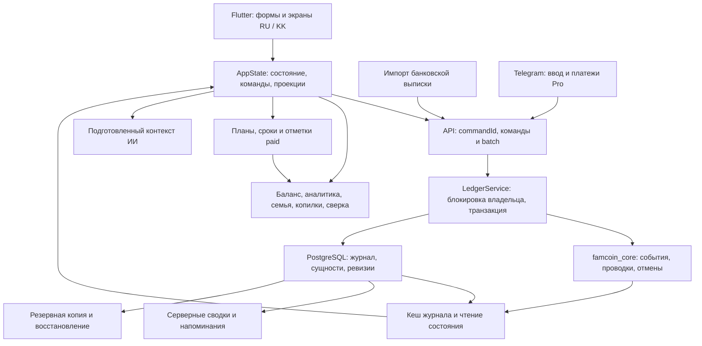

# FamCoin — технический аудит ядра и связей функций

**Дата: 5 октября 2026.** Проверен фиксированный снимок `fcd1fa1f481211daca8675595103879de9314d33` в отдельной рабочей копии. Отчёт относится к этому коду; состояние конкретного пользовательского аккаунта не исследовалось.

**Найдено 23 подтверждённых дефекта: 8 P1 и 15 P2.** Наиболее опасны повторные финансовые факты, обход ограничений долга через корзину, ошибочное связывание импортированных покупок с обязательствами, потеря события оплаты Pro и небезопасное восстановление базы. Основа двойной записи работает, но она не защищает от повторного логического события или потери связи между оплатой, расписанием и экраном.

**Для исправлений рекомендованы 55 новых постоянных тестовых кейсов и изменение 12 существующих.** Ещё 4 системных сценария — следующий этап, итого 59 новых в расширенном плане. До выпуска исправлений P1 — минимум 25 новых и 9 изменённых. Полный перечень с ожидаемым поведением и конкретными существующими тестами: [TEST-PLAN.md](TEST-PLAN.md).

Это аудит с воспроизведениями, а не выпуск исправлений. Продуктовый код, рабочие пользовательские данные, реальные Telegram-сообщения и оплаты не изменялись. Проверки PostgreSQL выполнены в отдельном временном контейнере с синтетическими данными. Диагностические исходники и журналы приложены; их успешный запуск означает воспроизведение наблюдаемого поведения, а не устранение ошибок.

## Статус исправлений (05.10.2026)

Исправлены все 23 дефекта и добавлены постоянные тесты; решения записаны как D124–D128 в `docs/decisions.md`. Проверено на коде после исправлений: ядро 165 тестов, приложение 237, сервер 180 на временной PostgreSQL 15, `deploy/restore_test.py` 7. На PostgreSQL 18, на рабочем сервере и с настоящим Telegram не проверялось.

| Дефекты | Решение |
|---|---|
| C01–C06, C08 | D125 |
| APP-03, APP-04, APP-07, R01–R04 | D126 |
| APP-01, APP-05, APP-06 | D127 |
| S01–S05, R05 | D128 |

Остаются продуктовые и операционные пункты: сверка уже накопленных пользовательских данных (дублей и отрицательных долгов, если они есть) выполняется отдельным списком для проверки, не автоматическим удалением; платёж Pro, который не обрабатывается 30 раз подряд, записывается в журнал сервера целиком для ручного начисления и больше не блокирует очередь бота; правило «название или категория совпали — связать без вопроса» в импорте выписки можно ужесточить до подтверждения всегда; два расписания платежа с исправлением старой формы поверх новой версии справочника (T46) защищены только для отметок оплаты, а не для названия и суммы.

---

## Что означают приоритеты

- **P1:** возможно неверное изменение денег/долга, повторное проведение факта, потеря оплаченного права Pro или данных при обслуживании. Исправить в первую очередь; сценарии не обязательно происходят при каждом обычном вводе.
- **P2:** подтверждённое расхождение представлений, дат, графиков, экспорта или доступности операции. Часть проявляется только при конкретной последовательности или через API; этот предел указан в описании.
- Неоднозначные продуктовые правила и риски роста выделены отдельно, не добавлены к 23 дефектам.

## Как связаны основные части приложения



Это упрощённая карта ответственности, не схема каждого HTTP-вызова. Источник финансовых фактов — журнал проводок. Рядом хранится состояние справочников и планов: например, множество оплаченных сроков `paid`. Их нужно согласованно обновлять, а все экраны должны одинаково интерпретировать события. Именно на этих переходах найдено больше всего ошибок.

Учётная модель проверялась по принятым решениям D109 и D111–D123: получение займа и погашение тела — движение денег и обязательства, не обычный доход/расход; покупка в рассрочку учитывает расход в момент покупки; списание личного долга меняет доход/расход без движения денег. Само превышение расходов над доходами за месяц не объявлялось ошибкой.

## Краткая карта подтверждённых проблем

| ID | Приоритет | Что нарушается | Наблюдаемый результат |
|---|---|---|---|
| C01 | P1 | Логическая единственность операции | Корзина позволяет восстановить одну покупку дважды |
| C02 | P1 | Остаток долга при восстановлении | Повторный возврат/списание создаёт отрицательный долг |
| C03 | P1 | Зависимости исходного долга | Можно удалить получение после погашения и получить отрицательное обязательство |
| C04 | P2 | Связь покупки и возврата | Восстановленный возврат не узнаёт восстановленную покупку |
| C05 | P2 | Округление графика | Один тиын добавляет четвёртый месяц вместо трёх |
| C06 | P2 | API старых резервов | Отрицательное освобождение увеличивает резерв |
| C08 | P2 | Архив счёта | Команда разархивирования отклоняет сам архивный счёт |
| APP-03 | P1 | Повтор отправки формы | Потерянный ответ и повтор создают второе списание |
| APP-04 | P1 | Платёж и его срок | Перехват кредитного платежа уменьшает долг, но не закрывает срок |
| APP-01 | P2 | Месячные обязательства | Недельные, годовые и месячные суммы складываются без приведения периода |
| APP-05 | P2 | Семья и возврат | Семейный экран показывает 10 000 вместо чистых 6 000 после возврата |
| APP-06 | P2 | Семейная аналитика | Покупка в рассрочку не попадает в распределение расходов по семье |
| APP-07 | P2 | Исторические остатки копилки | Связанные перевод и покупка попадают в разные месяцы |
| S01 | P1 | Импорт и обязательства | Покупка той же суммы становится коммуналкой либо исчезает как «кредит» |
| S02 | P1 | Доставка оплаты Pro | Telegram-update подтверждается даже после ошибки обработчика |
| S03 | P2 | Изоляция кеша | Читатель видит расход незавершённой, позднее отменённой транзакции |
| S04 | P2 | Экспорт CSV | Перевод 15 000 выгружается как 0 без счёта назначения |
| S05 | P2 | Сброс/удаление аккаунта | Конкурентная операция вызывает ошибку внешнего ключа и откат удаления |
| R01 | P2 | Два устройства | Факты оплат сохраняются, одна отметка оплаченного периода теряется |
| R02 | P2 | Старая сверка | Счётчик показывает четыре неоплаченных срока, список пуст |
| R03 | P2 | История расписания | Смена дня платежа создаёт новые просрочки в оплаченном прошлом |
| R04 | P2 | Завершённость долга | Список предстоящих очищается, сводка и календарь продолжают требовать платёж |
| R05 | P1 | Восстановление базы | DROP выполняется до проверки файла; SQL-ошибка может завершиться «успехом» |

ID сохранены от диагностических проб. Пропуск C07 не означает потерянную находку: это дополнительная проверка C01 после загрузки. APP-02 после проверки исключён из подтверждённых ошибок и разобран как M01 ниже. C01 и C04 имеют общую причину идентичности, но разные пользовательские последствия; их следует исправлять совместно.

## Результаты проверки и сборки

| Проверка | Результат | Что доказывает и чего не доказывает |
|---|---|---|
| Существующий набор ядра | 141 тест пройден | Проверенные формулы и сценарии; не полнота жизненного цикла |
| Существующий набор приложения | 207 тестов пройдено | Модель и widget-сценарии в текущих fixtures |
| Существующий набор сервера | 146 успешных в полном запуске; один длинный импорт превысил timeout | Запуск шёл через SSH-туннель; подробность ниже |
| Повтор всего набора импорта рядом с PostgreSQL | 16/16 пройдено за 4 с | Включая тот же длинный импорт 320 строк и cleanup |
| JavaScript startup/push | 15 тестов пройдено | Проверенные сценарии web-загрузки и push |
| Статический анализ core/app/server | Без замечаний | Синтаксис/типы/линтер, не корректность всех финансовых правил |
| Чистая PostgreSQL 18.6 | Все 18 миграций применились | Создание схемы с нуля, не обновление любой рабочей базы |
| `dart compile exe` сервера | Успешно | Локальная компиляция сервера |
| Flutter web release | Успешно, около 19 с | Web-сборка; не iOS/Android магазинные бинарники |
| RU/KK ресурсы | По 1 106 ключей, нет пропусков/пустых KK | Структурная полнота, не вычитка казахского носителем |
| Специальные диагностические тесты | 33 выполнено | 10 core, 7 app, 10 server, 5 сквозных app, 1 сквозной server; часть — положительные контроли/неоднозначное правило |
| Безопасная проверка restore | Два shell-сценария + проверка поведения psql | Порядок опасных действий и ложный успех без изменения рабочей базы |

Серверный набор нельзя описывать как один полностью зелёный прогон: первый запуск дал timeout длинного импорта и ошибку cleanup. Повтор через ту же удалённую связь даже с трёхминутным лимитом не завершился. Поэтому тот же файл тестов запущен в отдельном Dart-контейнере рядом с тестовой PostgreSQL: все 16 случаев прошли за четыре секунды. Это указывает на стоимость множества последовательных SQL round-trip в тестовом соединении; не является доказательством медленного производственного импорта. Конфликт сброса с записью S05 воспроизведён отдельно управляемыми блокировками, независимо от этого timeout.

Локально использовались Flutter **3.47.5** и Dart **3.13.4**. Релизный CI закрепляет Flutter **3.44.0**; его отдельная сборка и реальные телефоны здесь не проверялись. Web-сборка завершилась с предупреждениями о `cupertino_icons` и dry-run совместимости Wasm; успешный JS release не равен проверенному Wasm-приложению.

Зелёные текущие тесты не опровергают находки: часть проверяет только конечные суммы, часть заранее помечает срок оплаченным, часть вручную передаёт ключ повтора вместо нажатия реальной кнопки. Шесть тестов импорта прямо закрепляют неверную гипотезу, что совпадения суммы и даты достаточно для определения обязательства.

## Подробные находки: финансовое ядро

### C01 — P1. Корзина позволяет восстановить одну покупку дважды

**Путь пользователя.** В журнале записать покупку → удалить → восстановить → снова удалить восстановленную запись. В корзине появляются две версии одного события; восстановить обе.

**Воспроизведение.** Начальный счёт 100 000, покупка e1 = 10 000. `reverse(e1)` → `restore(e1, e2)` → `reverse(e2)` → `restore(e1, e3)` → `restore(e2, e4)`. Обе последние команды проходят. Баланс **80 000**, расход **20 000** вместо одной восстановленной покупки: баланс **90 000**, расход **10 000**. После JSON-сохранения и повторной загрузки ошибка сохраняется; перестройка дневных агрегатов тоже её сохраняет, поскольку журнал уже содержит два факта.

**Причина.** `isRestored` проверяет только прямого потомка `restoredFrom == txId`. Для e2 действующий e3 не считается восстановлением, поскольку e3 ссылается на e1. Нет общего идентификатора исходной операции по цепочке восстановлений.

**Ссылки.** [packages/famcoin_core/lib/src/ledger.dart:379–395](https://github.com/mumitrol16666-creator/FamCoin/blob/fcd1fa1f481211daca8675595103879de9314d33/packages/famcoin_core/lib/src/ledger.dart#L379-L395), `404–424`; [app/lib/state/app_state.dart:1633–1651](https://github.com/mumitrol16666-creator/FamCoin/blob/fcd1fa1f481211daca8675595103879de9314d33/app/lib/state/app_state.dart#L1633-L1651); доступная кнопка восстановления [app/lib/ui/ops/transaction_tile.dart:200–234](https://github.com/mumitrol16666-creator/FamCoin/blob/fcd1fa1f481211daca8675595103879de9314d33/app/lib/ui/ops/transaction_tile.dart#L200-L234).

**Почему ошибка.** Восстановление должно вернуть один удалённый факт. Оно не должно превращать его в две покупки и уменьшать капитал ещё на 10 000. Проверка единственной прямой копии даёт ложное ощущение защиты от повторного восстановления.

**Как исправить.**

1. Ввести единый логический корень операции с учётом `edited` и `restoredFrom` (с защитой от циклов и совместимостью со старым журналом).
2. Проверять действующую версию по всей цепочке. Корзина показывает один восстановимый элемент на логическую операцию; остальные версии остаются историей.
3. Отклонять восстановление любой старой версии, если в цепочке уже есть действующая запись. Проверку выполнять в ядре, чтобы она действовала и для API.
4. Не удалять существующие проводки автоматически при обновлении. Если понадобятся проверки реальных данных, найти цепочки с несколькими действующими копиями и разбирать их отдельно.

**Тесты: 2 новых + изменить 1 существующий.**

- Изменить `restore_test.dart`, тест «восстановление возвращает эффект операции и помнит исходную запись»: строки 42–45 сейчас прямо утверждают, что после повторного удаления обе версии находятся в корзине. Вместо этого проверить одну логическую запись и отказ второй попытки восстановления через другую версию.
- Новый `restore_test.dart`: та же цепочка после snapshot reload не допускает дубликат; расходы, деньги и капитал совпадают с единственной покупкой.
- Новый интеграционный тест приложения `app/test/technical_lifecycle_regression_test.dart`: корзина после двух циклов delete/restore показывает один восстановимый факт и не позволяет получить второй расход.

### C02 — P1. Восстановление возврата мне и списания обходит предел долга

**Путь пользователя.** Удалить возврат или списание, закрыть долг другой записью, затем восстановить первую запись из корзины.

**Воспроизведение A.** На счёте 100 000. Дал человеку 50 000 → получил 50 000 → удалил возврат → получил 50 000 другой записью → восстановил удалённый возврат. Ядро принимает его: деньги **150 000**, «мне должны» **−50 000**, строка «Мне вернули» **100 000**, хотя выдано 50 000. Ожидание — отказ без изменения журнала, поскольку требование уже закрыто.

**Воспроизведение B.** Долг 50 000 списан, списание удалено, долг списан другой записью, первая запись восстановлена. И у `receivable`, и у `liability` остаток становится **−50 000**. Расход при невозврате или доход при прощении достигает **100 000** вместо 50 000. Деньги не изменяются, но отчёт и капитал искажаются.

**Причина.** `_revalidateForRestore` повторно проверяет только `refund`, `loanPayment`, `repaymentMade`. Ветки `repaymentReceived` и `writeOff` отсутствуют. Прямые конструкторы этих событий остаток проверяют — значит одинаковая запись допустима через корзину и недопустима через обычную форму.

**Ссылки.** [packages/famcoin_core/lib/src/ledger.dart:430–460](https://github.com/mumitrol16666-creator/FamCoin/blob/fcd1fa1f481211daca8675595103879de9314d33/packages/famcoin_core/lib/src/ledger.dart#L430-L460); правильные проверки создания: `events.dart:335–342`, `479–484`. Сервер вызывает ту же команду без дополнительной защиты: [server/lib/ledger_service.dart:283–294](https://github.com/mumitrol16666-creator/FamCoin/blob/fcd1fa1f481211daca8675595103879de9314d33/server/lib/ledger_service.dart#L283-L294).

**Как исправить.** Объединить проверку доменных ограничений создания и восстановления. Для возврата мне проверить сумму основной части против оставшегося требования, для списания — соответствующую сторону долга. Проверять до `post`, возвращать стабильные `repaymentExceeds` / `writeOffExceeds`. Денежный процент не должен считаться телом долга.

**Тесты: 4 новых.** В `refund_chain_test.dart` или отдельном `debt_lifecycle_test.dart`: (1) возврат мне после закрытия новым возвратом отклоняется, (2) восстановление списания требования после другого закрытия отклоняется, (3) то же для обязательства, (4) допустимое частичное восстановление ровно на остаток проходит и отдельно учитывает проценты. Существующий тест «восстановление платежа по кредиту заново проверяет остаток долга» покрывает только одну из нескольких симметричных веток; он корректен, менять его ожидания не нужно.

### C03 — P1. Удаление исходного долга не проверяет уже сделанные погашения

**Путь пользователя.** Записать «Взял в долг», затем «Вернул долг», открыть первую запись в журнале и удалить её. Кнопка удаления существует для обоих событий.

**Воспроизведение.** Счёт 100 000 → взял 50 000 → вернул 50 000 → удалил получение. Баланс **50 000**, обязательство **−50 000**. Отчёт показывает получено в долг 0, погашено 50 000. Личный долг попадает в список с отрицательной суммой: приложение берёт любой `b != 0`. Никакой явной операции переплаты/превращения в «мне должны» не произошло.

**Причина.** `reverse` проверяет существование записи и то, что она ещё не отменена, затем безусловно инвертирует проводки. Приложение защищает от удаления покупки с действующим возвратом, но аналогичной защиты исходного займа/выдачи/рассрочки с последующими погашениями нет.

**Ссылки.** [packages/famcoin_core/lib/src/ledger.dart:361–376](https://github.com/mumitrol16666-creator/FamCoin/blob/fcd1fa1f481211daca8675595103879de9314d33/packages/famcoin_core/lib/src/ledger.dart#L361-L376); [app/lib/state/app_state.dart:1609–1628](https://github.com/mumitrol16666-creator/FamCoin/blob/fcd1fa1f481211daca8675595103879de9314d33/app/lib/state/app_state.dart#L1609-L1628), `520–530`; универсальная кнопка удаления [app/lib/ui/ops/transaction_tile.dart:302–312](https://github.com/mumitrol16666-creator/FamCoin/blob/fcd1fa1f481211daca8675595103879de9314d33/app/lib/ui/ops/transaction_tile.dart#L302-L312).

**Почему ошибка.** Доменные конструкторы запрещают погасить больше остатка. Удаление задним числом обходит тот же инвариант. Отрицательный долг здесь не является согласованной моделью переплаты: интерфейс не меняет сторону и не объясняет её.

**Как исправить.** До удаления проверять связанные активные погашения/списания. По умолчанию отклонять удаление, которое создаёт отрицательное обязательство или требование, и показывать связанные операции. Для исправления нескольких фактов предложить атомарный набор корректировок. Важно: не запретить промежуточную отмену внутри правки, когда заменяющая запись в той же пачке возвращает корректное состояние; финальный набор должен проверяться целиком. Если продукту нужна переплата, оформлять её как отдельное явное событие на противоположную сторону, а не молча оставлять минус.

**Тесты: 3 новых.** В `debt_lifecycle_test.dart`: удаление получения после погашения; удаление выдачи после возврата; удаление покупки в рассрочку после платежа. Проверить отказ и неизменность журнала, денег, требований/обязательств. В этом аудите численно воспроизведён первый сценарий; симметричные ветки следуют из общего `reverse`, но рекомендуются отдельные регрессионные кейсы. Существующий `scenarios_test.dart`, «отмена операции снимает эффект и сохраняет историю», проверяет обычный расход без зависимостей; корректный тест, но его зелёный результат не гарантирует безопасность удаления долга.

### C04 — P2. Возврат не узнаёт восстановленную покупку

**Путь пользователя.** Есть покупка и возврат. Сначала удалить возврат, затем покупку (это как раз разрешённый приложением порядок), восстановить покупку и попытаться восстановить возврат.

**Воспроизведение.** Покупка e1 = 10 000, возврат f1 = 10 000. После delete(f1), delete(e1), restore(e1 → e2) новая покупка видна и уменьшила деньги, но `currentVersion('e1') == null`. Восстановление f1 отклоняется с `purchaseCancelled`, хотя покупка уже восстановлена. Ожидание: восстановленный возврат закрывает восстановленную покупку; деньги возвращаются к 100 000, чистый расход 0.

**Причина.** `purchaseRoot` следует только `meta.edited`; восстановление ставит `meta.restoredFrom`, которое алгоритм игнорирует. Поэтому покупка и её прежние возвраты оказываются в разных цепочках. Это отдельный пользовательский симптом общей проблемы идентичности C01.

**Ссылки.** [packages/famcoin_core/lib/src/ledger.dart:327–343](https://github.com/mumitrol16666-creator/FamCoin/blob/fcd1fa1f481211daca8675595103879de9314d33/packages/famcoin_core/lib/src/ledger.dart#L327-L343), `416–422`, `432–437`; создание связи возврата [app/lib/state/app_state.dart:1205–1209](https://github.com/mumitrol16666-creator/FamCoin/blob/fcd1fa1f481211daca8675595103879de9314d33/app/lib/state/app_state.dart#L1205-L1209).

**Как исправить.** Использовать тот же нормализованный корень, что в C01, для `currentVersion`, `refundedFor`, проверки правки и восстановления возврата. После восстановления необходимо сохранить прежний лимит возврата, а не начать новый независимый лимит. Не убирать проверки возвратов и не лечить это созданием дубликата покупки.

**Тесты: 2 новых.** В `refund_chain_test.dart`: (1) восстановить удалённые покупку и её возврат в указанном порядке, (2) смешанная цепочка edit→delete→restore продолжает правильно учитывать прежние частичные возвраты и не допускает возврат больше суммы покупки. Существующий тест «после правки покупки возврат привязан к исходной версии» покрывает только `edited`; менять его не нужно, нужен соседний сценарий с `restoredFrom`.

### C05 — P2. Округление добавляет лишний месяц в график и сценарий досрочки

**Воспроизведение A.** `buildSchedule(principal: 100000₸, rate: 0, months: 3)` возвращает четыре платежа: **33 333,33 + 33 333,33 + 33 333,33 + 0,01**. Ожидание: три платежа, последний 33 333,34, долг в конце равен нулю.

**Воспроизведение B, пользовательский экран.** Остаток 150 000, платёж 50 000, ставка 0%; базовый срок 3 месяца. Досрочно внести 50 000. Вариант «Уменьшить платёж» показывает **4 платежа вместо сохранения 3**, хотя пользователь уменьшил долг. Именно этот результат выводится экраном досрочки.

**Причина.** `months` используется только для расчёта округлённого аннуитетного платежа; цикл затем работает до нулевого остатка без учёта заданного количества месяцев. Оставшийся тиын создаёт новый месяц. В `earlyRepayment` число `baseline.months` не передаётся как ограничение нового графика.

**Ссылки.** [packages/famcoin_core/lib/src/formulas/loans.dart:65–90](https://github.com/mumitrol16666-creator/FamCoin/blob/fcd1fa1f481211daca8675595103879de9314d33/packages/famcoin_core/lib/src/formulas/loans.dart#L65-L90), `159–177`; [app/lib/ui/budget/debt_screens.dart:216–230](https://github.com/mumitrol16666-creator/FamCoin/blob/fcd1fa1f481211daca8675595103879de9314d33/app/lib/ui/budget/debt_screens.dart#L216-L230), `251–257`.

**Как исправить.** Разделить режим «задан платёж» и «задан срок». В графике с заданным сроком последний платёж закрывает оставшееся тело плюс проценты с согласованным округлением, без дополнительного месяца ради тиына. Для варианта уменьшения платежа явно сохранять базовый срок. Не превращать непокрывающий проценты платёж в скрытый большой последний платёж; текущая защита невыполнимого сценария должна сохраниться.

**Тесты: 2 новых.** В `formulas_test.dart`: неделимая на месяцы сумма 100 000/3 под 0%; досрочка 150 000→100 000 сохраняет 3 месяца при уменьшении платежа, сумма тела всех строк точно равна 100 000. Существующие T15/T16 используют делимые числа, поэтому округление не испытывают; их корректные ожидания менять не надо.

### C06 — P2. Отрицательное освобождение резерва увеличивает копилку

**Достижимость.** Подтверждено на общем командном API ядра; `release` есть в белом списке команд сервера. Текущая основная модель целей использует отдельные счета, поэтому не утверждается, что обычная форма новой копилки отправляет отрицательную сумму. Это дефект старого механизма резервов/API, а не доказанное частое действие пользователя.

**Воспроизведение A.** Деньги 100 000, резерв 50 000. Команда `release amount=-100000` проходит и повышает резерв до **150 000**, свободные деньги **−50 000**. Баланс денежных счетов не изменяется.

**Воспроизведение B.** `postFromReservation` при списании 5 000 и `amount=-5000` проводит расход, но вместо уменьшения повышает резерв 50 000→55 000. Деньги становятся 95 000.

**Причина.** В `release` и `postFromReservation` нет проверки положительности `amount`; сравнение `r.amount < amount` отрицательное значение пропускает, затем вычитание минуса увеличивает резерв. `parseMinor` разбирает знак и сам по себе не проверяет правила конкретного действия.

**Ссылки.** [packages/famcoin_core/lib/src/ledger.dart:685–704](https://github.com/mumitrol16666-creator/FamCoin/blob/fcd1fa1f481211daca8675595103879de9314d33/packages/famcoin_core/lib/src/ledger.dart#L685-L704); `commands.dart:69`, `134–135`; сервер `ledger_service.dart:283–294`.

**Как исправить.** Требовать `0 < amount <= maxAmount` в обеих точках. В `postFromReservation` проверять это до `post`, чтобы отказ не оставил проведённый расход с неизменным резервом. Использовать общий валидатор денежной величины, затем существующую проверку достаточности резерва.

**Тесты: 2 новых.** В `commands_test.dart` один тест проверяет отрицательную, нулевую и слишком большую сумму release: доменная ошибка и полная неизменность резерва. В `scenarios_test.dart` второй тест проверяет `postFromReservation` с отрицательной суммой: операция не добавлена, резерв и деньги прежние. Существующая проверка атомарности только для несбалансированных проводок не покрывает эту ветку.

### C08 — P2. Архивирование нельзя отменить через существующую команду

**Воспроизведение.** Архивировать денежный счёт. Отправить `archiveAccount` с `archived:false`. Ядро возвращает **accountArchived**, счёт остаётся архивным с прежним остатком. Команда явно имеет переключатель `archived`, но состояние false недостижимо для архивного счёта.

**Пользовательская связь.** В экране счёта действие существует лишь для `!info.archived`; кнопки возврата из архива нет. При отмене импорта с заменой начального остатка бот прямо требует «верните его из архива, чтобы отменить импорт». Пользователь не может выполнить предложенное действие ни через интерфейс, ни через общую команду.

**Причина.** Обе ветки `archiveAccount` вызывают `requireActiveMoney` до установки флага. Эта проверка запрещает именно исходное состояние, из которого нужно разархивировать.

**Ссылки.** [packages/famcoin_core/lib/src/commands.dart:89–91](https://github.com/mumitrol16666-creator/FamCoin/blob/fcd1fa1f481211daca8675595103879de9314d33/packages/famcoin_core/lib/src/commands.dart#L89-L91); `ledger.dart:244–249` (проверка денежного/архивного счёта); [app/lib/ui/more/accounts_screen.dart:99–107](https://github.com/mumitrol16666-creator/FamCoin/blob/fcd1fa1f481211daca8675595103879de9314d33/app/lib/ui/more/accounts_screen.dart#L99-L107); [server/lib/statement_import.dart:739–742](https://github.com/mumitrol16666-creator/FamCoin/blob/fcd1fa1f481211daca8675595103879de9314d33/server/lib/statement_import.dart#L739-L742).

**Как исправить.** Проверять существование и денежный тип счёта независимо от архива, затем устанавливать запрошенный флаг. Добавить понятное действие «Вернуть из архива». На сервере разархивирование должно проверять ограничение тарифа на число активных денежных счетов так же, как добавление; иначе исправление откроет обход Free. Для отмены импорта можно отдельно рассмотреть безопасную корректировку архивного счёта, но инструкция бота должна вести к реально доступному действию.

**Тесты: 1 новый + изменить 1 существующий.** Расширить `commands_test.dart`, «операция с архивного счёта отклоняется, история остаётся»: архивный счёт запрещает новые траты, затем разархивируется, сохраняет остаток/историю и снова принимает операцию. Новый тест приложения `app/test/technical_lifecycle_regression_test.dart` проверяет кнопку возврата из архива и отображение серверного отказа по Free вместо ложного успеха. Проверку тарифного ограничения в серверных интеграционных тестах следует включить в серверный план; здесь отдельным кейсом не посчитана, чтобы не дублировать владельца серверного аудита.

## Подробные находки: приложение и формы

### APP-03 · P1 · Повтор оплаты после потери ответа создаёт второе списание

**Как воспроизвести.** На счёте 100 000 ₸, неоплаченная аренда 10 000 ₸. Открыть оплату срока. Сервер принимает платёж, но ответ теряется. Форма остаётся открытой с ошибкой сети. Нажать «Оплатить» ещё раз.

**Фактически:** два расхода по 10 000 ₸, остаток 80 000 ₸. В плане при этом одна отметка `paid = {'2026-09'}` — по ней дубликат не виден. **Ожидалось:** один расход и остаток 90 000 ₸, повтор получает состояние уже принятой команды.

**Причина:** [app/lib/ui/budget/sheets.dart:107](https://github.com/mumitrol16666-creator/FamCoin/blob/fcd1fa1f481211daca8675595103879de9314d33/app/lib/ui/budget/sheets.dart#L107) вызывает `state.payDue(...)` без `commandId`; [app/lib/state/app_state.dart:1154](https://github.com/mumitrol16666-creator/FamCoin/blob/fcd1fa1f481211daca8675595103879de9314d33/app/lib/state/app_state.dart#L1154) разрешает передать ключ, но при отсутствии ключа каждый вызов строит новый факт, а `send` генерирует новый ключ. Блокировка `SubmitButton` защищает только одновременный двойной тап, но снимается после сетевой ошибки.

**Почему это ошибка:** повторная попытка завершить одну оплату должна быть безопасной независимо от того, дошёл ли ответ. Здесь меняются деньги и отчёт, хотя нового пользовательского намерения не было. Новый `commandId` делает серверную защиту неприменимой.

**Исправление:** хранить неизменяемый payload, идентификатор факта и `commandId` на одну отправку формы. После неопределённой сетевой ошибки повторять именно его; изменение полей после такой ошибки сначала должно разрешать статус предыдущей отправки. Распространить этот общий механизм на формы банковского/личного погашения, пополнения/снятия копилки и возврата покупки: у них найден тот же шаблон свежего ключа (`sheets.dart:177`, `208`, `350`, `edit_transaction_sheet.dart:287`; `app_state.dart:1148`, `1671`). Не считать отсутствие повтора в ручной форме «Доход» доказательством для всех форм.

**Проверка:** виджетный сценарий принятого сервером платежа с потерянным ответом уже приведён в probe APP-03. Минимально нужны **5 новых regression tests**: оплата срока; частичное погашение банковского долга; частичный возврат личного долга; пополнение/снятие копилки (таблица двух направлений внутри одного теста); частичный возврат покупки. Во всех — accepted+lost response, повтор, один факт, точный итог двух сторон. Имеющийся F06 в [app/test/audit_regression_test.dart:797](https://github.com/mumitrol16666-creator/FamCoin/blob/fcd1fa1f481211daca8675595103879de9314d33/app/test/audit_regression_test.dart#L797) изменить: он передаёт `commandId` вручную непосредственно в AppState и не проверяет, сохраняет ли его реальная форма. Сохранить положительный кейс, но провести его через форму дохода.

### APP-04 · P1 · Перехват «это платёж по кредиту» не закрывает оплаченный срок

**Как воспроизвести.** Долг 100 000 ₸, платёж за сентябрь 10 000 ₸ ещё не оплачен. Через «＋ → Расход» записать 10 000 ₸ с заметкой «Kaspi Red за сентябрь», принять предложение «Платёж по кредиту», подтвердить оплату.

**Фактически:** долг уменьшился до 90 000 ₸, со счёта ушло 10 000 ₸, но сентябрьский срок всё ещё неоплачен, `paid` пуст и у факта нет `meta.planned`. Платёж повторно входит в предстоящие/просроченные обязательства. **Ожидалось:** если пользователь подтверждает оплату сентябрьского срока, она закрывает именно этот срок; досрочная дополнительная оплата должна быть отдельным явно выбранным режимом.

**Причина:** [app/lib/ui/ops/add_transaction_sheet.dart:375](https://github.com/mumitrol16666-creator/FamCoin/blob/fcd1fa1f481211daca8675595103879de9314d33/app/lib/ui/ops/add_transaction_sheet.dart#L375) открывает `showBankPaySheet` — форму досрочного/внеграфикового платежа. Она вызывает `payDebt` (`sheets.dart:177`, `app_state.dart:1148`), а не `payDue`. Передаётся только долг и сумма, поэтому также теряются выбранные в исходном расходе дата и счёт; сумма расхода трактуется как тело, а не полный платёж. D112 обещает решить повторяющийся срок, но реализует только уменьшение долга.

**Почему это ошибка:** два связанных представления одной оплаты расходятся. Пользователь видит и факт оплаты, и напоминание оплатить ту же сумму, а свободные деньги дополнительно уменьшаются на уже выполненное обязательство. Возникает риск повторного ввода.

**Исправление:** после распознавания дать выбор конкретного неоплаченного срока и варианта «Досрочно / вне графика». Передавать исходные сумму, дату, счёт, затем разделить сумму платежа на тело/проценты. Оплата выбранного срока и его отметка должны быть одной командой; отмена должна открывать тот же срок.

**Проверка:** probe APP-04 проходит настоящий UI-путь. **Изменить** существующий тест [app/test/ux_gaps_a_test.dart:133](https://github.com/mumitrol16666-creator/FamCoin/blob/fcd1fa1f481211daca8675595103879de9314d33/app/test/ux_gaps_a_test.dart#L133) «расход с названием кредита…»: сейчас он проверяет только баланс долга и отсутствие обычного расхода, а план заводится со значением `paidThisMonth=true`, скрывающим дефект. Установить `paidThisMonth=false`, проверить закрытие сентября, `meta.planned/period`, уменьшение обязательств и восстановление срока при отмене. Добавить **2 новых теста**: сохранение выбранных даты/счёта и общей суммы при процентах; явный выбор между несколькими просроченными сроками и досрочной оплатой.

### APP-01 · P2 · Ежемесячные обязательства игнорируют периодичность

**Как воспроизвести.** Завести репетитора 5 000 ₸ каждую среду и страховку 120 000 ₸ раз в год в ноябре.

**Фактически:** `recurringMonthly = 125 000 ₸`. Для октября 2026 расписание правильно выдаёт четыре среды, то есть 20 000 ₸, а годовой срок в октябрь не входит. Если нужна средняя нагрузка за год, она тоже не равна 125 000 ₸: годовой платёж надо распределять по 12 месяцам, недельный — переводить в месячную величину. **Ожидалось:** явно определённая величина — обязательства конкретного месяца либо нормализованная средняя нагрузка — с учётом частоты.

**Причина:** [app/lib/state/app_state.dart:1408](https://github.com/mumitrol16666-creator/FamCoin/blob/fcd1fa1f481211daca8675595103879de9314d33/app/lib/state/app_state.dart#L1408) просто суммирует `p.amount`. После D116 суммы имеют разные единицы: «за неделю», «за год», «за месяц». Ошибочное число идёт в `recurringShareOfIncome`, `incomeLooksIncomplete` и в AI-поля `recurringPaymentsPerMonth` / `looksIncomplete` ([app/lib/ui/more/ai_context.dart:297–303](https://github.com/mumitrol16666-creator/FamCoin/blob/fcd1fa1f481211daca8675595103879de9314d33/app/lib/ui/more/ai_context.dart#L297-L303)).

**Почему это ошибка:** складываются величины разных периодов. Календарь может быть верен, но приложение/ИИ делают вывод о месячной нагрузке и якобы неполных доходах на другом основании.

**Исправление:** разделить `scheduledAmountForMonth(month)` по реальным `PaySchedule.occurrences` и, если нужна, `averageMonthlyCommitment` с отдельным документированным правилом год/неделя. Не называть простую сумму тарифов «в месяц». Передавать в AI единицы и выбранный период. Использовать один расчёт в UI и AI.

**Проверка:** probe APP-01. **2 новых теста**: недельная сумма в месяце с четырьмя/пятью сроками (таблица); годовой платёж в месяце срока и вне него плюс числовое соответствие AI-контекста. Существующий тест `analytics_state_test.dart:250` о закрытых кредитах остаётся полезен и не нуждается в подмене ожиданий: он не проверяет частоты.

### APP-05 · P2 · «Семья» завышает расход после возврата относительно аналитики

**Как воспроизвести.** Покупка одежды 10 000 ₸ «для общего», затем возврат 4 000 ₸ в том же месяце. Открыть аналитику и «Ещё → Семья».

**Фактически:** аналитика показывает «Общее 6 000 ₸», семейный экран — «Общее 10 000 ₸». **Ожидалось:** 6 000 ₸ в обоих местах для одного периода и определения расходов.

**Причина:** [app/lib/ui/more/family_screen.dart:23–28](https://github.com/mumitrol16666-creator/FamCoin/blob/fcd1fa1f481211daca8675595103879de9314d33/app/lib/ui/more/family_screen.dart#L23-L28) самостоятельно суммирует только `EventType.expense`. `AppState.expenseByWho` уже учитывает возвраты и наследует принадлежность покупки, но FamilyScreen этот метод не использует.

**Почему это ошибка:** оба экрана подписаны как расходы семьи за месяц; возврат не должен существовать только в одном из них. Исправленный ранее F04/F10 агрегатор не подключён ко всем потребителям.

**Исправление:** FamilyScreen должен брать единую `expenseByWho(monthStart)` и единые правила месяца/принадлежности. Суммы нельзя дублировать локальным циклом UI.

**Проверка:** probe APP-05 использует настоящий `FamilyScreen`. **1 новый widget test** (таблица RU/KK и частичного/полного возврата), сравнивающий числовые MoneyText двух экранов с агрегатором. Existing `analytics_state_test.dart:330` о наследовании `who` оставить: он проверяет только агрегатор, а не этот экран.

### APP-06 · P2 · Расходы в рассрочку исчезают из семейной аналитики

**Как воспроизвести.** В семейном режиме записать в рассрочку телефон за 120 000 ₸ и выбрать «Для кого → Общее».

**Фактически:** общий отчёт и категория показывают 120 000 ₸, в событии сохранён `meta.who='shared'`, но `expenseByWho` возвращает пустую карту и семейная разбивка скрывается. **Ожидалось:** «Общее 120 000 ₸» и совпадение суммы семейной разбивки с расходами за этот период.

**Причина:** [app/lib/state/app_state.dart:998](https://github.com/mumitrol16666-creator/FamCoin/blob/fcd1fa1f481211daca8675595103879de9314d33/app/lib/state/app_state.dart#L998) разрешает только типы `expense` и `refund`; новый `creditPurchase` не проходит фильтр. Тот же подход исключает расходы других типов (проценты в `loanPayment`, списание требования `writeOff`). Категории и общий отчёт в отличие от этого считают проводки расходов.

**Почему это ошибка:** форма сохраняет выбранного человека, однако использующий эту информацию отчёт теряет целую покупку. Это особенно заметно после новой функции D111, где большие покупки теперь заводятся через этот тип события.

**Исправление:** определять расход по проводкам `LedgerKind.expense` всех активных событий, а принадлежность — по единому правилу: `meta.who`, наследование возврата, затем явное значение по умолчанию / «Не распределено». В идеале такой агрегатор должен жить рядом с ядром отчётов, чтобы новые типы событий автоматически учитывались всеми проекциями. После этого применить его к APP-05.

**Проверка:** probe APP-06. **1 новый test** с таблицей `expense/refund/creditPurchase/loanPayment/writeOff` и инвариантом `sum(expenseByWho.values) == report.expense` для одного периода. Это не заменяет отдельный UI-тест APP-05.

### APP-07 · P2 · Оплата покупки из копилки задним числом искажает остатки на конец месяца

**Как воспроизвести.** В сентябре на счёте 100 000 ₸; отложить в копилку покупки 50 000 ₸. 5 октября отметить покупку за 50 000 ₸ как оплаченную 30 сентября, используя связанную копилку.

**Фактически:** расход датирован 30 сентября, возврат 50 000 ₸ из копилки — 5 октября. На 30 сентября приложение показывает счёт 0 ₸ и копилку 50 000 ₸. **Ожидалось:** счёт 50 000 ₸ и копилку 0 ₸, если покупка 30 сентября действительно была оплачена накоплениями. Текущий суммарный остаток совпадает, но исторические остатки разных счетов — нет.

**Причина:** [app/lib/state/app_state.dart:1156](https://github.com/mumitrol16666-creator/FamCoin/blob/fcd1fa1f481211daca8675595103879de9314d33/app/lib/state/app_state.dart#L1156) соблюдает переданную дату расхода, но строка 1165 вызывает `closeGoalCommands` без неё; `closeGoalCommands:1701` всегда ставит переводу `today` и использует текущий, а не исторический баланс.

**Почему это ошибка:** одна составная операция разносится по разным месяцам без решения пользователя. Это напрямую портит сверку остатков на конец месяца и способно побудить человека внести ненужную корректировку. При пополнениях копилки после выбранной даты механическое перенесение всего сегодняшнего остатка назад дополнительно создало бы отрицательный исторический остаток.

**Исправление:** передавать дату факта всем финансовым частям составной оплаты; вычислять допустимую сумму возврата из копилки на эту дату. При более поздних пополнениях или движениях не архивировать автоматически весь текущий счёт как будто их не было: явно выбрать частичное использование копилки или предложить разобраться с более поздними движениями. Только смена `today` на `date` без исторической проверки недостаточна.

**Проверка:** probe APP-07. **2 новых tests**: оплата покупки из копилки в прошлом месяце проверяет обе проводки и остатки на последнюю дату; после даты оплаты есть дополнительное пополнение — поздние деньги не переносятся задним числом и не теряются при закрытии. **Изменить** существующий D90 в `audit_regression_test.dart:548`: дополнительно проверить согласованность дат перевода и расхода, а также остатков обоих счетов; текущий тест проверяет только конечные суммы при оплате сегодня.

## Подробные находки: сервер и внешние потоки

### S01 · P1 · Импорт считает постороннюю покупку оплатой обязательства

**Сценарий.** В бюджете есть коммунальный платёж 5 000 ₸, срок 15 сентября. В выписке одна покупка MAGNUM на 5 000 ₸ 12 сентября. Она не относится к коммунальным услугам.

**Ожидание.** Импорт записывает покупку продуктов, коммунальный платёж остаётся неоплаченным. Совпадение суммы и близость даты могут предложить связь для подтверждения, но не устанавливать её самостоятельно.

**Факт.** `planImport` преобразует строку MAGNUM в `PlanGroup.planned`, записывает категорию `utilities`, заменяет заметку на «Коммунальные услуги» и создаёт отметку `paid: ['2026-09']`. Эта покупка также перестаёт быть повседневным расходом для дневного лимита. Если вместо коммуналки создать рассрочку с тем же платежом, MAGNUM вообще попадает в `loans` и не записывается: журнал оставляет 100 000 ₸ вместо банковских 95 000 ₸, поле `gap` становится `null`.

**Причина.** В [server/lib/statement_plan.dart:413](https://github.com/mumitrol16666-creator/FamCoin/blob/fcd1fa1f481211daca8675595103879de9314d33/server/lib/statement_plan.dart#L413) функция `dueFor` проверяет только отрицательную сумму, её равенство сумме обязательства и разницу дат не более 10 дней. Она не проверяет получателя, описание, категорию или подтверждённое правило. [server/lib/statement_plan.dart:554](https://github.com/mumitrol16666-creator/FamCoin/blob/fcd1fa1f481211daca8675595103879de9314d33/server/lib/statement_plan.dart#L554) без дополнительной проверки либо создаёт оплату, либо исключает строку как кредитную. [server/lib/statement_import.dart:604](https://github.com/mumitrol16666-creator/FamCoin/blob/fcd1fa1f481211daca8675595103879de9314d33/server/lib/statement_import.dart#L604) добавляет `markCommand` к записи факта, а эта команда обновляет `paid` в справочнике.

**Почему это ошибка.** Пользователь получает объективно другую финансовую операцию: купил продукты, приложение показывает погашенные коммунальные услуги. Автоматически меняется обязательство и дневной лимит, хотя подтверждающих данных нет. Для рассрочки пропадает реальный расход из импортируемого журнала. Само отсутствие записи по кредиту при неизвестной разбивке допустимо; ошибка — относить к кредиту любую постороннюю покупку с подходящей суммой.

**Исправление.** Разделить поиск кандидатов и проведение связи. По сумме/дате предлагать «Возможно, это платёж…» и оставлять исходную классификацию до подтверждения. Только явно подтверждённая связь `(строка выписки, plannedId, period)` может добавлять `meta.planned`/`paid` или переводить строку в ручной разбор кредита. При нескольких кандидатах требовать выбора. Сохранять исходное описание MAGNUM в метаданных и показывать его рядом с выбранным обязательством. Для повторных импортов использовать подтверждённый идентификатор связи, а не повторное угадывание.

**Доказательство.** Первые два теста `S-IMPORT` в диагностическом файле. Они проверяют итоговый `command`, `mark`, остаток и отсутствие сверки, а не только текст подсказки. Не требуется повреждённый PDF или нестандартный запрос: вход — обычная корректная строка выписки.

### S02 · P1 · Ошибка обработки Telegram-платежа приводит к потере события оплаты

**Сценарий.** Telegram прислал `successful_payment` с `update_id=100`. Обработчик падает до записи платежа в PostgreSQL, например во время краткого обрыва базы. Пользователь уже оплатил Pro.

**Ожидание.** Событие остаётся доступным для повторной обработки; после восстановления базы тот же charge включает Pro ровно один раз.

**Факт.** Следующий вызов транспорта — `getUpdates(offset: 101)`, хотя обработчик упал и никаких данных не сохранил. Исключение только записывается в stderr. Для Telegram такой offset подтверждает событие 100: оно не будет автоматически доставлено снова. Это соответствует [контракту Telegram Bot API — getUpdates](https://core.telegram.org/bots/api#getupdates), проверенному 05.10.2026.

**Причина.** [server/lib/telegram.dart:214](https://github.com/mumitrol16666-creator/FamCoin/blob/fcd1fa1f481211daca8675595103879de9314d33/server/lib/telegram.dart#L214) увеличивает `_offset` до `_handle`. [server/lib/telegram.dart:230](https://github.com/mumitrol16666-creator/FamCoin/blob/fcd1fa1f481211daca8675595103879de9314d33/server/lib/telegram.dart#L230) ловит исключение и продолжает цикл без восстановления позиции или записи задания на повтор. Платёжный обработчик вызывается в [server/lib/telegram.dart:244](https://github.com/mumitrol16666-creator/FamCoin/blob/fcd1fa1f481211daca8675595103879de9314d33/server/lib/telegram.dart#L244); запись `payments` и включение Pro находятся в [server/lib/billing.dart:134](https://github.com/mumitrol16666-creator/FamCoin/blob/fcd1fa1f481211daca8675595103879de9314d33/server/lib/billing.dart#L134). Защита `charge_id` от повторов в BillingService есть, но повторная доставка транспортом уже потеряна.

**Почему это ошибка.** Ошибка инфраструктуры превращается в необходимость ручного поиска оплаты: деньги приняты внешней системой, право Pro не выдано, собственного надёжного события для восстановления нет. Это не теоретическая разница порядков async: тест непосредственно записал следующий offset после исключения.

**Исправление.** Надёжный вариант — сначала сохранять входящее событие в таблицу inbox с уникальным `update_id`, а уже после commit подтверждать его offset и обрабатывать с повторами. Для оплаты использовать имеющийся уникальный `charge_id`, чтобы повтор после сбоя не продлевал Pro дважды. До появления inbox минимальная защита: повышать offset только после успешной обработки и не переходить к подтверждению более поздних событий из той же пачки при ошибке предыдущего. После ограниченного числа неуспешных попыток событие должно оставаться в сохраняемой очереди ошибок, а не исчезать. Простого переноса присваивания `_offset` вниз недостаточно, если цикл после сбоя продолжит обрабатывать и подтвердит последующие update.

**Доказательство.** `S-TG` использует fake Telegram, передаёт синтетическое `successful_payment`, обработчик кидает `StateError` до каких-либо записей. Зафиксированы один вызов обработчика и offsets `[0, 101]`. Указанный в логе stack trace — намеренная инъекция сбоя, а не падение набора тестов. Реальная оплата не выполнялась.

### S03 · P2 · Чтение для бота видит незавершённую транзакцию через общий кеш

**Сценарий.** Есть 100 000 ₸. API выполняет batch: расход 5 000 ₸ → обновление справочника → некорректная команда. Пока обновление справочника ждёт блокировку строки, бот читает `LedgerService.view`. В конце batch откатывается.

**Ожидание.** Читатель видит согласованный подтверждённый снимок — 100 000 ₸, либо ждёт завершения команды. Отменённая операция никогда не должна попадать в ответ или использоваться для следующего плана импорта.

**Факт.** `view` возвращает 95 000 ₸ и операцию `not-committed`, хотя отдельный SQL-запрос подтверждает: в таблице `transactions` такой операции нет. После rollback следующий `view` снова показывает 100 000 ₸. Второй тест показывает дополнительную проблему: уже возвращённый объект `LedgerView` сам меняет баланс со 100 000 на 95 000 после более поздней успешной команды.

**Причина.** [server/lib/ledger_service.dart:88](https://github.com/mumitrol16666-creator/FamCoin/blob/fcd1fa1f481211daca8675595103879de9314d33/server/lib/ledger_service.dart#L88) возвращает ссылку на mutable Ledger из общего кеша. `command` в строках 239–242 изменяет этот же экземпляр до commit. В `view` запрос владельца на строке 189 не содержит `FOR SHARE`, а возвращаемый на строке 203 журнал не копируется. Откат базы корректен и кеш удаляется при исключении, но ранее выданный объект уже содержал неверные данные.

**Реальный охват.** Прямые потребители `view` — `ChatEntry` и `StatementImport`: ответы/черновики Telegram, подбор счетов для голосового ввода, построение импорта. Голосовой обработчик удерживает view во время распознавания ([server/lib/chat_entry.dart:833](https://github.com/mumitrol16666-creator/FamCoin/blob/fcd1fa1f481211daca8675595103879de9314d33/server/lib/chat_entry.dart#L833)), поэтому окно для изменения уже полученного объекта может быть значительным. Основной `/state`, CSV/JSON export и NotificationService используют другой путь `state()` с `FOR SHARE`; данный тест не доказывает наличие грязного чтения в этих путях. AIService получает контекст от клиента: прямое влияние этого cache bug на ИИ не утверждается.

**Почему это ошибка.** У PostgreSQL write-транзакция действительно атомарна, но общее mutable состояние приложения обходит её гарантию. Можно объяснить пользователю расход, который затем никогда не появится в журнале, или сопоставить выписку с недействительным расходом. Кеш здесь меняет смысл данных, а не только скорость чтения.

**Исправление.** Команда должна работать с отдельной копией Ledger и публиковать новый экземпляр кеша только после успешного commit. Читающие API должны получать immutable snapshot, а не объект, который будущая команда будет менять. Чтение revision/ledger/entities согласовать одной блокировкой владельца (`FOR SHARE` как в `state`) либо транзакцией с подходящей изоляцией; возвращаемый снимок должен оставаться неизменным и после отпускания блокировки. Только добавление `FOR SHARE` не устраняет второй воспроизведённый случай.

**Доказательство.** Два теста `S-CACHE` на настоящей PostgreSQL 18. Первый ждёт подтверждённое состояние `pg_stat_activity.wait_event_type='Lock'`, а не случайную задержку; затем сопоставляет SQL и view, отпускает блокировку и проверяет rollback. Второй сохраняет старый view и проверяет его изменение после новой команды.

### S04 · P2 · CSV теряет сумму и второй счёт перевода

**Сценарий.** Пользователь перевёл 15 000 ₸ с Kaspi Gold в наличные и выгрузил журнал CSV.

**Ожидание.** Выгрузка позволяет увидеть сумму перевода, исходный счёт и счёт назначения. Комиссия, если есть, отличима от самой суммы.

**Факт.** Строка CSV:

```text
2026-09-12;;transfer;;Kaspi Gold;0;;;active;move-1
```

В строке отсутствуют и 15 000, и «Наличные». При комиссии вместо суммы перевода в текущую колонку попадёт только отрицательная комиссия, поскольку это суммарное изменение всех денежных счетов.

**Причина.** [server/lib/export.dart:68](https://github.com/mumitrol16666-creator/FamCoin/blob/fcd1fa1f481211daca8675595103879de9314d33/server/lib/export.dart#L68) оставляет первый денежный счёт, а строка 69 складывает все денежные проводки. У перевода две противоположные проводки взаимно обнуляются. Полученный net cash delta записывается в колонку «Сумма» ([server/lib/export.dart:89](https://github.com/mumitrol16666-creator/FamCoin/blob/fcd1fa1f481211daca8675595103879de9314d33/server/lib/export.dart#L89)).

**Почему это ошибка.** Нулевое суммарное изменение денег верно для капитала, но не является суммой перевода. CSV заявлен как журнал с типом, счётом и суммой операции. По нему нельзя восстановить или проверить движение между счетами. Исходные проводки и JSON-экспорт при этом сохранены; ошибки в самой базе этот сценарий не создаёт.

**Исправление.** Задать явный контракт CSV: для перевода выводить сумму движения, «Со счёта», «На счёт» и отдельную комиссию; для остальных типов оставить корректные денежные значения. Альтернатива — отдельный бухгалтерский экспорт по проводкам с общей ссылкой на transaction ID, но это уже иной формат. При рекомендуемом добавлении колонок синхронно обновить локализованные заголовки в [app/lib/ui/more/export.dart:58](https://github.com/mumitrol16666-creator/FamCoin/blob/fcd1fa1f481211daca8675595103879de9314d33/app/lib/ui/more/export.dart#L58), сериализатор и ожидания CSV-теста. Не заменять net delta на первый попавшийся абсолютный amount для всех типов: это сломает составные кредитные/расходные операции.

**Доказательство.** `S-CSV` строит реальный transfer через famcoin_core и проверяет итоговую строку `csvJournal`, а не подставляет готовый ошибочный snapshot.

### S05 · P2 · Сброс или удаление аккаунта конфликтуют с обычной записью операции

**Сценарий.** Пользователь нажимает «Начать заново» или удалить аккаунт, пока другая вкладка/устройство записывает расход. Сброс удаляет дочерние записи журнала несколькими SQL-запросами, а новая операция успевает записаться между ними.

**Ожидание.** Операции одного владельца выполняются в определённом порядке: сначала закончить запись и стереть её вместе с остальным журналом, либо сначала завершить сброс/удаление и корректно отклонить команду на уже несуществующий счёт/аккаунт. Ошибка внешнего ключа не должна попадать в HTTP 500.

**Факт.** Для обеих функций воспроизведено: новая expense успешно commit'ится, затем erase падает с `SQLSTATE 23503`, поскольку новые postings всё ещё ссылаются на удаляемый ledger_account. Весь erase откатывается, аккаунт и старые данные остаются. После неудачного удаления баланс 95 000 ₸: исходные 100 000 минус конкурентный расход 5 000. Частичного удаления в проверенном сценарии нет — транзакция БД защищает от него.

**Причина.** [server/lib/auth_service.dart:289](https://github.com/mumitrol16666-creator/FamCoin/blob/fcd1fa1f481211daca8675595103879de9314d33/server/lib/auth_service.dart#L289) и `:304` сначала удаляют дочерние таблицы; строка владельца блокируется только последним UPDATE/DELETE. В отличие от `LedgerService.command`, нет `SELECT ... FROM users WHERE id=@u FOR UPDATE` в начале. Между DELETE postings и DELETE ledger_accounts может появиться новая ссылка. Запросы при обычной изоляции читают разные снимки, что делает ручной каскад удаления несогласованным с конкурентной командой.

**Почему это ошибка.** Разрешённая пара действий приводит к технической ошибке вместо предсказуемого результата. Это особенно заметно при нескольких открытых вкладках, автоматическом импорте или ещё выполняющейся команде с другого устройства. Пользователь не получает завершённое удаление/сброс и должен повторять его.

**Исправление.** До любого дочернего DELETE взять блокировку владельца в одной транзакции, совместимую с порядком блокировок `LedgerService.command`; проверить существование пользователя в этот момент. Для всех финансовых writers сохранять одинаковый порядок «владелец → дочерние данные». После commit сброса инвалидировать кеш, как уже делает API. Не скрывать FK-ошибку ответом «успешно» и не удалять ограничения целостности.

**Доказательство.** Два теста `S-ERASE`. Отдельная синтетическая транзакция удерживает старую запись `opening`, erase останавливается на DELETE transactions после удаления старых postings. Состояние ожидания проверено через `pg_stat_activity`; затем обычная `LedgerService.command` пишет новую expense. После отпуска блокировки обе функции завершаются именно кодом 23503. Это детерминированная проверка межшагового окна, а не случайное совпадение по sleep. Она не доказывает, что любая ошибка удаления в production вызвана этой гонкой.

## Подробные находки: связи функций и эксплуатация

### R01 · P2 · Два устройства могут потерять отметку уже оплаченного срока

**Воспроизведение.** Один владелец открыл приложение на двух устройствах. Оба получили план аренды с неоплаченными сентябрём и октябрём. Первое устройство записывает сентябрьские 10 000 ₸; второе, ещё со старым состоянием, записывает октябрьские 10 000 ₸. Обе финансовые операции сохранены, баланс со 100 000 стал 80 000 ₸. Но в `paid` остаётся только октябрь, и сентябрь снова показывается неоплаченным.

**Почему ошибка.** Это не обычные последовательные нажатия на одном обновлённом экране, а реальный сценарий устаревшей формы/второго устройства. Повторное чтение после ответа не помогает: сервер уже принял устаревший полный JSON и потерял первую отметку. Атомарность отдельного batch не защищает от потери изменений между двумя batch.

**Причина и ссылки.** [app/lib/state/app_state.dart:1154](https://github.com/mumitrol16666-creator/FamCoin/blob/fcd1fa1f481211daca8675595103879de9314d33/app/lib/state/app_state.dart#L1154) отправляет сохранённый `p.toJson(paid: {...p.paid, due.period})`. [server/lib/ledger_service.dart:235](https://github.com/mumitrol16666-creator/FamCoin/blob/fcd1fa1f481211daca8675595103879de9314d33/server/lib/ledger_service.dart#L235) проверяет `expectedRevision` только для сверки; [server/lib/ledger_service.dart:318](https://github.com/mumitrol16666-creator/FamCoin/blob/fcd1fa1f481211daca8675595103879de9314d33/server/lib/ledger_service.dart#L318) безусловно заменяет `entities.data`. Подтверждено двумя независимыми AppState с общим транспортом FakeServer; серверная операция замены JSON дополнительно проверена по реальному коду. Это отдельный сценарий от APP-03, где теряется HTTP-ответ и дублируется факт.

**Как исправить.** Ввести серверную доменную команду `payOccurrence(plannedId, occurrenceId, ...)`: сервер под блокировкой читает актуальный срок, проводит факт и добавляет отметку. Условие уникальности должно защищать сам оплачиваемый срок, кроме транспортного commandId. Если нужны частичные платежи — это отдельные записи исполнения с суммой, а не повтор одного полного срока. Для обычного редактирования справочников нужна версия сущности/проверка ожидаемой ревизии, чтобы старая форма не затирала новые название, сумму или расписание.

**Проверка.** `ROOT-01` в `root-app-probe.log`: две клиентские модели, разные периоды, две операции и потерянная отметка. Регрессионные T44–T46 проверяют разные сроки, один срок с двух клиентов и конфликт старой формы с новой версией справочника.

### R02 · P2 · В старой сверке исчезают неоплаченные недельные сроки

**Воспроизведение.** В сентябре четыре занятия по понедельникам, каждое 5 000 ₸, ни одно не оплачено. Открыть сверку сентября 1 декабря. Итоги месяца говорят «оплачено 0 из 4», но список неоплаченных сроков пуст. Экран использует его для сообщения об отсутствии ожидающих платежей. Общая сумма скрытых сроков — 20 000 ₸.

**Почему ошибка.** Ограничивать длину текущего списка удобно, но историческая сверка должна показывать проверяемый месяц целиком. Записи не удалены; они отфильтрованы относительно сегодняшней даты, а не выбранного периода.

**Причина и ссылки.** [packages/famcoin_core/lib/src/schedule.dart:70](https://github.com/mumitrol16666-creator/FamCoin/blob/fcd1fa1f481211daca8675595103879de9314d33/packages/famcoin_core/lib/src/schedule.dart#L70) ограничивает обзор недельных сроков 56 днями; [app/lib/state/app_state.dart:700](https://github.com/mumitrol16666-creator/FamCoin/blob/fcd1fa1f481211daca8675595103879de9314d33/app/lib/state/app_state.dart#L700) всегда вызывает `scanFrom(today)`. [app/lib/ui/budget/month_close_screen.dart:76](https://github.com/mumitrol16666-creator/FamCoin/blob/fcd1fa1f481211daca8675595103879de9314d33/app/lib/ui/budget/month_close_screen.dart#L76) использует этот обзор для старого месяца. В то же время [app/lib/state/app_state.dart:745](https://github.com/mumitrol16666-creator/FamCoin/blob/fcd1fa1f481211daca8675595103879de9314d33/app/lib/state/app_state.dart#L745) считает количество сроков именно выбранного месяца.

**Как исправить.** Отделить обзор ближайших/недавних платежей от запроса точного исторического интервала. Сверка и историческая аналитика должны получать `unpaidOccurrences(from, to)` без обрезания относительно today. В текущем обзоре старые долги по срокам можно сворачивать в строку «Ещё N просроченных», сохраняя доступ к ним.

**Проверка.** `ROOT-02` воспроизводит 0/4 в сводке и пустой список. T47 проверяет старые месяцы для недельного/годового/месячного расписаний и согласованность счётчика, суммы и списка.

### R03 · P2 · Смена расписания создаёт новые просрочки в уже оплаченном прошлом

**Воспроизведение.** Все понедельники сентября оплачены: 7, 14, 21 и 28 сентября. 28 сентября изменить день занятий на вторник через тот же `copyWith(every: week, weekday: 2)`, который использует форма. Появляются неоплаченные 1, 8, 15 и 22 сентября — ещё 20 000 ₸ прошлых сроков, хотя до редактирования весь сентябрь был закрыт.

**Почему ошибка.** `paid` физически сохраняется, но старые ключи понедельников уже не соответствуют новому расписанию. Сохраняется массив строк, а смысл истории оплат теряется. Пользователь менял условия платежа; ему не показывают, что тем самым создаются новые обязанности задним числом. При смене month→week меняется и формат ключей, создавая ту же проблему.

**Причина и ссылки.** [app/lib/ui/budget/sheets.dart:420](https://github.com/mumitrol16666-creator/FamCoin/blob/fcd1fa1f481211daca8675595103879de9314d33/app/lib/ui/budget/sheets.dart#L420) сохраняет изменённое расписание без даты вступления в силу; [app/lib/state/models.dart:241](https://github.com/mumitrol16666-creator/FamCoin/blob/fcd1fa1f481211daca8675595103879de9314d33/app/lib/state/models.dart#L241) переносит прежние `paid/start`; [packages/famcoin_core/lib/src/schedule.dart:86](https://github.com/mumitrol16666-creator/FamCoin/blob/fcd1fa1f481211daca8675595103879de9314d33/packages/famcoin_core/lib/src/schedule.dart#L86) заново создаёт все сроки по новым правилам. По новой дате невозможно надёжно найти старое исполнение.

**Как исправить.** Добавить дату действия новой версии расписания и устойчивый идентификатор срока. Уже наступившие/оплаченные сроки сохраняют свои дату, сумму и исполнения. По умолчанию менять только будущие; историческую правку делать отдельным явным действием с предпросмотром затронутых сроков. Удаление или восстановление старого факта должно работать с исходным occurrenceId, а не искать срок в новом расписании.

**Проверка.** `ROOT-03` воспроизводит четыре ложные просрочки. T48–T49 покрывают смену дня/периодичности и последующую отмену/восстановление старой оплаты.

### R04 · P2 · Предстоящие платежи скрывают закрытый долг, а календарь и сводка продолжают требовать оплату

**Воспроизведение.** Рассрочка с остатком 50 000 ₸ и месячным платежом 10 000 ₸ полностью погашена в сентябре. 5 октября в приложении нет неоплаченного срока: долг равен нулю. Утренняя сводка при тех же финансовых данных пишет «Сегодня к оплате: Рассрочка — 10 000 ₸». Отдельная widget-проба ROOT-04b подтверждает: октябрьский CalendarScreen тоже показывает неоплаченный DueTile на 10 000 ₸ с кнопкой «Списалось».

**Почему ошибка.** Один план считается завершённым в списке предстоящих AppState.dueItems, но действующим в календаре и уведомлении. Пользователь может решить, что погашение не учлось, и повторить запись. Сам журнал здесь не повреждён.

**Причина и ссылки.** [app/lib/state/app_state.dart:1394](https://github.com/mumitrol16666-creator/FamCoin/blob/fcd1fa1f481211daca8675595103879de9314d33/app/lib/state/app_state.dart#L1394) фильтрует планы через остаток долга. [server/lib/briefs.dart:22](https://github.com/mumitrol16666-creator/FamCoin/blob/fcd1fa1f481211daca8675595103879de9314d33/server/lib/briefs.dart#L22) проверяет только расписание и `paid`; доступный `BriefInput.ledger` для завершённости долга не используется. [server/lib/notifications.dart:178](https://github.com/mumitrol16666-creator/FamCoin/blob/fcd1fa1f481211daca8675595103879de9314d33/server/lib/notifications.dart#L178) передаёт все планы. [app/lib/ui/budget/calendar_screen.dart:40](https://github.com/mumitrol16666-creator/FamCoin/blob/fcd1fa1f481211daca8675595103879de9314d33/app/lib/ui/budget/calendar_screen.dart#L40) также перебирает state.planned напрямую и формирует неоплаченный DueTile на строке 136. Нулевая сумма долга не означает, что все будущие ключи `paid` уже записаны.

**Как исправить.** Вынести единое правило активности связанного обязательства в общий слой и применять перед календарём, сводками и подсчётом обязательств. Полное погашение не должно требовать создания бесконечного набора будущих отметок «оплачено». Частичное погашение сохраняет план; повторное открытие долга восстанавливает нужное поведение явно. Для исторического календаря сохранить уже оплаченные сроки: нельзя просто скрыть всю прошлую историю по сегодняшнему нулевому остатку. Будущие сроки после завершения долга должны исчезать либо показываться отменёнными без требования оплаты.

**Проверка.** Парные `ROOT-04`: AppState подтверждает пустой список, сервер формирует лишнюю строку; `ROOT-04b` проходит настоящий CalendarScreen и подтверждает лишнюю кнопку оплаты. T50 проверяет активный/закрытый долг в утренней и вечерней сводках на двух языках; T55 отдельно проверяет виджет календаря и сохранение оплаченной истории.

### R05 · P1 · Восстановление из резервной копии может удалить базу до проверки файла и сообщить об успехе при SQL-ошибке

**Сценарий A.** Оператор ошибся в имени файла копии и подтвердил запуск `restore.sh`. Скрипт сначала останавливает API и выполняет `DROP DATABASE`, а только затем `gunzip` обнаруживает отсутствие файла. Результат — прежняя база уже удалена, восстановление не выполнено, API остановлен.

**Сценарий B.** Архив читается, но внутри возникает ошибка SQL. Вызов `psql` сделан без `ON_ERROR_STOP=1`; стандартное поведение продолжает исполнение и возвращает 0. Скрипт запускает API и пишет «восстановлено», хотя часть данных/объектов могла не восстановиться.

**Почему ошибка.** Восстановление — последний механизм защиты финансовой истории. Оно должно проверять пригодность копии до уничтожения действующей базы и не сообщать успех без проверки результата. Это не сценарий обычной кнопки пользователя, но высокая тяжесть для обслуживания сервиса.

**Доказательство и пределы.** Реальный `deploy/restore.sh` выполнен в безопасной оболочке с заменой `docker` заглушкой: `restore-probe.json` фиксирует порядок DROP до чтения отсутствующего файла и ложный успешный exit при SQL-ошибке. Отдельный реальный PostgreSQL-тест в базе `audit_restore_probe` подтвердил поведение `psql`: между двумя успешными INSERT вызвана несуществующая функция, ошибка выведена, в таблице две строки, код завершения 0. Рабочая база не открывалась и не заменялась.

**Ссылки.** [deploy/restore.sh:14](https://github.com/mumitrol16666-creator/FamCoin/blob/fcd1fa1f481211daca8675595103879de9314d33/deploy/restore.sh#L14), [deploy/restore.sh:15](https://github.com/mumitrol16666-creator/FamCoin/blob/fcd1fa1f481211daca8675595103879de9314d33/deploy/restore.sh#L15), [deploy/restore.sh:16](https://github.com/mumitrol16666-creator/FamCoin/blob/fcd1fa1f481211daca8675595103879de9314d33/deploy/restore.sh#L16), [deploy/restore.sh:18](https://github.com/mumitrol16666-creator/FamCoin/blob/fcd1fa1f481211daca8675595103879de9314d33/deploy/restore.sh#L18).

**Как исправить.** До остановки API проверить путь, права, `gzip -t` и метаданные копии. Восстанавливать во временную базу с `psql -v ON_ERROR_STOP=1` и подходящей транзакционностью, затем проверять схему/миграции, ключевые количества и финансовые инварианты. Переключать приложение на восстановленную базу только после успешной проверки; сохранять исходную базу/предварительную копию для отката. Везде проверять exit code; failure trap не должен запускать приложение поверх заведомо неполного восстановления. Успех отмечать только после smoke-проверки API и данных.

**Проверки T51–T53.** Отсутствующий/повреждённый архив не вызывает DROP или остановку сервиса; SQL-ошибка не приводит к переключению и успеху; корректная копия восстанавливается с совпадающими балансами и схемой. В аудите эти продуктовые исправления не внесены.

## Что исправлять и в каком порядке

1. **Сначала защитить финансовые факты.** Общий логический идентификатор операции, валидация восстановления и отмены на итоговом состоянии batch, стабильный ключ отправки формы. Это C01–C04 и APP-03. Не исправлять только внешний вид корзины: API должен отвергать ту же ошибочную последовательность.
2. **Согласовать оплату с конкретным сроком.** Серверная команда оплаты срока, устойчивый `occurrenceId`, контроль устаревших форм и версии расписания с датой действия. Это APP-04, R01–R03. Обновление полного клиентского JSON `paid` нельзя считать надёжной записью исполнения.
3. **Убрать небезопасные автоматические решения и потерю внешних событий.** Подтверждаемое сопоставление импорта S01, надёжное сохранение Telegram-событий S02, восстановление во временную базу R05. Эти три пункта не зависят от редизайна экранов.
4. **Сделать чтение согласованным.** Копия журнала на запись, публикация кеша после commit, неизменяемые снимки, одинаковый порядок блокировок для команды и удаления. Это S03/S05.
5. **Объединить расчёты для разных представлений.** Месячная нагрузка, семейные расходы, активность погашенного долга, исторические даты копилок. Это APP-01, APP-05–APP-07, R04. ИИ должен получать те же проверенные агрегаты и период, что видит пользователь.
6. **Закрыть локальные дефекты.** Округление графика C05, входные ограничения резервов C06, разархивирование с проверкой тарифа C08, полноценный CSV S04. После общих изменений повторить связанные существующие suites.

Сверку уже накопленных пользовательских данных стоит планировать отдельно после исправления правил. Не выполнять автоматическое удаление «похожих» фактов: две одинаковые покупки могут быть реальными. Для подозрительных цепочек готовить список исходных событий, изменённых остатков и предлагаемой корректировки, сохраняя историю. Этот аудит не утверждает, что все описанные ошибки уже произошли в чьём-либо аккаунте.

## Неоднозначные правила и риски, не включённые в число дефектов

**M01 — дата первого платежа рассрочки при вводе задним числом.** Покупка от 10 сентября вводится 5 октября, в форме выбран «первый платёж в следующем месяце». Сейчас начало считается от дня ввода и даёт 25 ноября. Если понимать «следующий» относительно покупки, получится 25 октября, но текст формы явно не задаёт эту точку отсчёта, а договор может действительно начинаться в ноябре. Поэтому первоначальный APP-02 исключён из подтверждённых ошибок. Рекомендация: явное поле даты первого платежа и предпросмотр ближайших сроков; после выбора правила добавить его отдельные проверки. Они не включены в обязательные 55.

**M02 — финансовый день и часовой пояс.** Приложение опирается на день устройства, серверные сводки — на UTC+5. Для обычного использования в Казахстане это может совпадать, но поездка или неверная настройка телефона меняет границу периода. Нужен договорённый пояс учёта владельца, используемый везде. Без этого нельзя назвать одну из трактовок правильной и зафиксировать ожидания T59.

**M03 — история на годы.** В синтетическом журнале 30 000 операций на Apple M4 баланс считался за 1,357 мс, отчёт последнего месяца — за 0,466 мс; декодирование с восстановлением всего журнала — за 126,332 мс, сериализация — примерно за 72 мс. JSON журнала — около 7,34 MB. Это не измерения iPhone, сети, PostgreSQL или Flutter UI. Подробные условия, ограничения и исходные результаты: [performance.md](artifacts/performance.md).

Основной риск роста — загрузка/передача всей истории, а не доказанная медленная арифметика ядра. Сначала измерить запуск, память, поиск и переключение старых месяцев на устройствах с 1k/10k/30k. Если профиль подтвердит проблему — стартовая серверная сводка, страницы журнала для просмотра и синхронизация после ревизии. Баланс нельзя считать по одной загруженной странице. Серверный кеш по ревизии уже существует, а локальная команда обычно не требует загрузки всей истории; переписывать это вслепую не нужно.

**M04 — семантика рекомендуемого взноса в цель.** Текущая формула и существующие тесты закрепляют конкретное понимание «нужно в месяц». Без согласованного определения это не самостоятельная подтверждённая арифметическая ошибка. Сначала определить, показывается остаток взноса текущего месяца или равномерный темп до даты цели.

**M05 — свежесть после возврата из фона.** Ручное обновление есть; автоматического перечитывания при каждом возврате нет. Это ограничение UX/актуальности экрана. Причину ранее описанного белого экрана Telegram на реальном iPhone этот аудит не устанавливает: устройство и соответствующий сетевой переход не воспроизводились.

## Что уже работает и чего аудит не обещает

Отдельные проверки настоящей PostgreSQL подтвердили откат неуспешной пачки: финансовый журнал, сущности, ключ команды и ревизия не остаются частично записанными. Восемь одновременных одинаковых commandId дают один финансовый факт и семь ответов о повторе. Значит, не нужно заменять всё хранилище: нужно довести эти гарантии до реальных форм и сделать чтение кеша безопасным.

Проверены код основных финансовых функций, их связи и выделенные сценарии, а не все возможные комбинации входов. Не проводились полноценный security penetration test, вычитка переводов носителем, реальные покупки Pro, проверка восстановления рабочей базы, физические iOS/Android прогоны, аудит персональных операций владельца. Проценты покрытия строк не использовались как доказательство финансовой корректности.

## Доказательства и воспроизведение

- [План всех новых и изменяемых тестов](TEST-PLAN.md).
- [Исходники диагностик, журналы и порядок безопасного запуска](artifacts/README.md).
- [Подробности ядра](artifacts/core-findings.md), [приложения](artifacts/app-findings.md), [сервера](artifacts/server-findings.md), [сквозных сценариев](artifacts/root-findings.md).
- [Замер многолетней истории](artifacts/performance.md).

Все ссылки на строки исходников ниже и выше относятся к зафиксированному commit. После исправлений номера могут сдвинуться; сценарий и инвариант важнее номера строки. Архивированные диагностические тесты не добавлены в постоянный CI: сначала требуется исправление, затем правильные ожидаемые результаты из TEST-PLAN.md.
